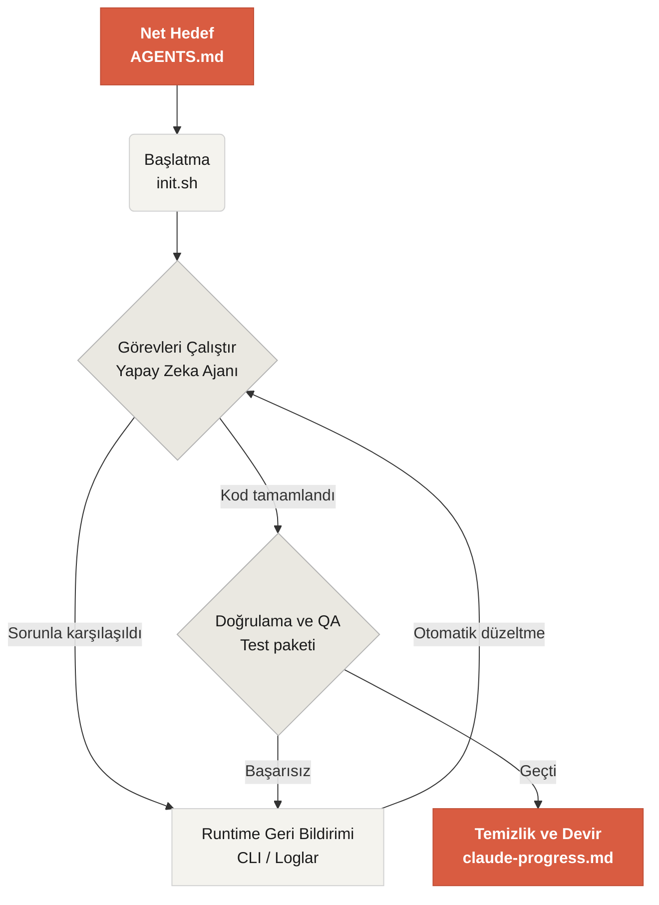

# Learn Harness Engineering'e hoş geldiniz

Learn Harness Engineering, yapay zeka kod yazma ajanlarının mühendisliğine adanmış bir kurstur. Sektördeki en ileri Harness Engineering teorisini ve uygulamalarını derinlemesine inceleyip sentezledik. Temel referanslarımız:
- [OpenAI: Harness engineering — Codex'ten agent-first bir dünyada yararlanmak](https://openai.com/index/harness-engineering/)
- [Anthropic: Uzun süreli ajanlar için etkili harness'lar](https://www.anthropic.com/engineering/effective-harnesses-for-long-running-agents)
- [Anthropic: Uzun süreli uygulama geliştirme için harness tasarımı](https://www.anthropic.com/engineering/harness-design-long-running-apps)
- [Awesome Harness Engineering](https://letslego.github.io/harness-engineering)

Sistematik ortam tasarımı, durum yönetimi, doğrulama ve kontrol sistemleri aracılığıyla bu kurs, Codex ve Claude Code gibi ajan tabanlı kod araçlarını gerçekten güvenilir hale getirmeyi öğretir. Yapay zeka kod asistanınızı açık kurallar ve sınırlarla kısıtlayarak özellik geliştirmenize, hataları düzeltmenize ve geliştirme görevlerini otomatikleştirmenize yardımcı olur.

## Başlangıç

Başlamak için öğrenme yolunuzu seçin. Kurs üç bölümden oluşur: teorik dersler, uygulamalı projeler ve doğrudan kullanılabilen bir kaynak kütüphanesi.

  <a href="./lectures/lecture-01-why-capable-agents-still-fail/" class="card">
    <h3>Dersler</h3>
    
Güçlü modellerin neden hâlâ başarısız olduğunu anlayın ve etkili harness'ların ardındaki teoriyi öğrenin.

  </a>
  <a href="./projects/" class="card">
    <h3>Projeler</h3>
    
Güvenilir bir ajan ortamını sıfırdan kurmak için uygulamalı çalışma.

  </a>
  <a href="./resources/" class="card">
    <h3>Kaynak Kütüphanesi</h3>
    
Kendi depolarınızda kullanabileceğiniz hazır şablonlar (AGENTS.md, feature_list.json).

  </a>

## Harness'ın temel mekanizması

Harness modeli "daha akıllı yapmaz"; modelin etrafına kapalı döngülü bir **çalışma sistemi** kurar. Temel iş akışını şu basit şema üzerinden anlayabilirsiniz:

## Neler öğreneceksiniz

Edineceğiniz temel kavramlardan bazıları:

<ul class="index-list">
  <li><strong>Ajan davranışını kısıtlayın</strong> — açık kurallar ve sınırlarla.</li>
  <li><strong>Bağlamı koruyun</strong> — uzun süreli, çok oturumlu görevlerde.</li>
  <li><strong>Ajanları durdurun</strong> — zaferi çok erken ilan etmesinler.</li>
  <li><strong>Çalışmayı doğrulayın</strong> — uçtan uca testler ve öz değerlendirmeyle.</li>
  <li><strong>Runtime'ı gözlemlenebilir</strong> ve hata ayıklanabilir yapın.</li>
</ul>

## Sonraki adımlar

Temel kavramları anladıktan sonra bu rehberler daha derine inmenize yardımcı olur:

<ul class="index-list">
  <li><a href="./lectures/lecture-01-why-capable-agents-still-fail/">Ders 01: Güçlü Ajanlar Neden Hâlâ Başarısız Olur</a>: Harness mühendisliğinin teorisiyle başlayın.</li>
  <li><a href="./projects/project-01-baseline-vs-minimal-harness/">Proje 01: Temel vs. Minimum Harness</a>: İlk gerçek görevinizi adım adım yapın.</li>
  <li><a href="./resources/templates/">Şablonlar</a>: Kendi projeleriniz için minimum harness paketini (AGENTS.md, feature_list.json, claude-progress.md) alın.</li>
</ul>
