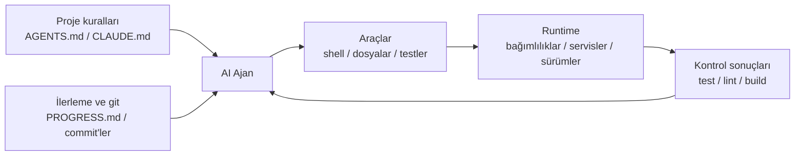

[中文版本 →](../../../zh/lectures/lecture-02-what-a-harness-actually-is/)

> Kod örnekleri: [code/](https://letslego.github.io/harness-engineering/en/lectures/lecture-02-what-a-harness-actually-is/code)
> Uygulama projesi: [Proje 01. Yalnızca prompt vs. önce kurallar](./../../projects/project-01-baseline-vs-minimal-harness/)

# Ders 02. Harness aslında nedir

"Harness" kelimesi yapay zeka kod yazma ajanı çevrelerinde sıkça kullanılıyor ama açıkçası çoğu insan harness derken "bir prompt dosyası" demek istiyor. Bu harness değildir. Bir restoranı yalnızca malzemelerle açmaya benzer — ocak yok, bıçak yok, tarif yok, sunum akışı yok. Bu bir restoran değil. Bu bir buzdolabıdır.

Bu ders size kesin, eyleme dönüştürülebilir bir harness tanımı veriyor. Akademik bir soyutlama değil, bugün kullanabileceğiniz bir çerçeve: bir harness, her biri net sorumluluklara ve değerlendirme kriterlerine sahip beş alt sistemden oluşur.

## Bir benzetmeyle başlayalım

Hiç dokümantasyon olmayan bir projeye atılmış yeni işe başlamış bir mühendis olduğunuzu hayal edin. README yok, kodda yorum yok, kimse testlerin nasıl çalıştırılacağını söylemiyor, CI yapılandırması bir yerlerde gömülü. İyi kod yazabilir misiniz? Belki — yeterince zeki ve sabırlıysanız. Ama "sorunu çözmek" yerine "bu projenin ne hakkında olduğunu çözmek" için çok büyük zaman harcayacaksınız.

Bir yapay zeka ajanı tam olarak aynı durumla karşı karşıyadır. Ve daha kötüdür — siz en azından bir meslektaşınıza sorabilirsiniz. Ajan yalnızca önüne koyduğunuz dosyaları ve çalıştırabildiği komutları görebilir. Birisinin omzuna dokunup "hey, bu proje ORM'nin hangi sürümünü kullanıyor?" diye soramaz.

OpenAI temel ilkeyi "depo şartnamenin kendisidir" olarak çerçeveliyor — gerekli tüm bağlamın yapılandırılmış talimat dosyaları, açık doğrulama komutları ve net dizin organizasyonu aracılığıyla depoda olması gerekir. Anthropic'in uzun süre çalışan ajanlar dokümantasyonu durum kalıcılığını, açık kurtarma yollarını ve yapılandırılmış ilerleme takibini vurgular. İki şirket farklı yönlere odaklanıyor ama aynı şeyi söylüyorlar: **model dışındaki tüm mühendislik altyapısı modelin yeteneğinin ne kadarının gerçekten kullanıldığını belirler.**

Zaten bildiğiniz bazı araçlara bakın:

**Claude Code** harness düşüncesini somutlaştırır. Deponuzdan `CLAUDE.md` okur (tarif rafı), kabuk komutları çalıştırabilir (bıçaklık), yerel ortamınızda yürütülür (ocak), oturum geçmişini tutar (hazırlık tezgâhı) ve testleri çalıştırıp sonuçları görebilir (kalite kontrol penceresi). Ama testleri nasıl çalıştıracağını söylemezseniz, kalite kontrol penceresi bozuktur — yemeğin pişip pişmediğini kimse bilmez.

**Cursor** benzer bir mantık izler. `.cursorrules` dosyası tarif rafıdır, terminal bıçaklıktır, proje yapınızı ve lint yapılandırmanızı ocak için okur. Ama Cursor'ın durum yönetimi nispeten zayıftır — IDE'yi kapatıp tekrar açtığınızda önceki bağlam gitmiştir.

**Codex** (OpenAI'nin kod yazma ajanı) her görevin runtime ortamını izole etmek için git worktree'leri kullanır, yerel bir gözlemlenebilirlik yığınıyla (günlükler, metrikler, izler) eşleştirilmiştir, böylece her değişiklik bağımsız bir ortamda doğrulanır. `AGENTS.md` ve net doğrulama komutlarına sahip depolarda "çıplak" depolardan çok daha iyi performans gösterir.

**AutoGPT** ise uyarıcı örnektir — yapılandırılmış durum yönetiminin eksikliği uzun görevlerde bağlam birikimine yol açar ve hassas geri bildirim mekanizmalarının eksikliği ajanın döngüye girmesine neden olur. Çoğu kişi AutoGPT'nin "çalışmadığını" söylüyor, ama aslında çalışmayan AutoGPT'nin harness'ıdır — bir aşçıya bozuk bir ocak verin, en iyi malzemeler bile bir yemek üretmez.

## Temel kavramlar

- **Harness nedir**: Model ağırlıkları dışındaki tüm mühendislik altyapısı. OpenAI mühendisin temel işini üç şeye indirgiyor: ortamları tasarlamak, niyeti ifade etmek ve geri bildirim döngüleri kurmak. Anthropic Claude Agent SDK'sını "genel amaçlı bir agent harness" olarak adlandırıyor.
- **Depo tek doğruluk kaynağıdır**: Ajanın göremediği her şey, pratik olarak yoktur. OpenAI depoyu "kayıt sistemi" olarak ele alır — gerekli tüm bağlam yapılandırılmış dosyalar ve net dizin organizasyonu aracılığıyla orada yaşamalıdır.
- **Manuel değil, harita verin**: OpenAI'nin tecrübesi — `AGENTS.md` bir ansiklopedi değil, bir içerik sayfası olmalıdır. Yaklaşık 100 satır yeterlidir. Sığmıyorsa `docs/` dizinine bölün ve ajanın talep üzerine okumasına izin verin.
- **Kısıtlayın, mikromanaje etmeyin**: İyi bir harness ajanı tek tek talimatları saymak yerine yürütülebilir kurallarla kısıtlar. OpenAI "değişmezleri zorla, uygulamayı mikromanaje etme" diyor; Anthropic ajanların kendi işlerini güvenle övdüğünü buldu ve çözüm "işi yapan kişi" ile "işi kontrol eden kişiyi" ayırmak.
- **Bileşenleri tek tek kaldırın**: Her harness bileşeninin marjinal katkısını ölçmek için bunları tek tek kaldırın ve hangisinin kaldırılmasının en büyük performans düşüşüne neden olduğunu görün. Anthropic bu yöntemi kullandı ve modeller güçlendikçe bazı bileşenlerin artık kritik olmaktan çıktığını buldu — ancak her zaman yenileri ortaya çıkıyor.

## Beş alt sistemli harness modeli

Mutfak benzetmesine dönelim. Eksiksiz bir mutfak beş işlevsel alana sahiptir ve bir harness'ın beş alt sistemi vardır:



**Talimat alt sistemi (tarif rafı)**: Proje genel bakışı ve amaç (bir cümle), teknoloji yığını ve sürümler (Python 3.11, FastAPI 0.100+, PostgreSQL 15), ilk çalıştırma komutları (`make setup`, `make test`), pazarlık kabul etmez sert kısıtlamalar ("Tüm API'ler OAuth 2.0 kullanmalı") ve daha ayrıntılı dokümantasyona bağlantılar içeren bir `AGENTS.md` (veya `CLAUDE.md`) oluşturun.

**Araç alt sistemi (bıçaklık)**: Ajanın yeterli araç erişimine sahip olduğundan emin olun. "Güvenlik" için shell'i devre dışı bırakmayın — ajan `pip install` bile çalıştıramazsa nasıl çalışacak? Ama her şeyi de açmayın — en az ayrıcalık ilkelerini izleyin.

**Ortam alt sistemi (ocak)**: Ortam durumunu kendi kendini tanımlayan hâle getirin. Bağımlılıkları kilitlemek için `pyproject.toml` veya `package.json`, runtime sürümleri için `.nvmrc` veya `.python-version`, tekrarlanabilirlik için Docker veya devcontainers kullanın.

**Durum alt sistemi (hazırlık tezgâhı)**: Uzun görevler ilerleme takibine ihtiyaç duyar. Basit bir `PROGRESS.md` dosyası kullanın: ne tamamlandı, ne devam ediyor, ne engellendi. Her oturum sona ermeden önce güncelleyin, sonraki oturum başlarken okuyun.

**Geri bildirim alt sistemi (kalite kontrol penceresi)**: Bu en yüksek getirili alt sistemdir. `AGENTS.md` içinde doğrulama komutlarını açıkça listeleyin:
```
Doğrulama komutları:
- Testler: pytest tests/ -x
- Tip kontrolü: mypy src/ --strict
- Lint: ruff check src/
- Tam doğrulama: make check (yukarıdakilerin tümünü içerir)
```

Herhangi bir alt sistemin eksikliği mutfakta bir işlevsel alanın eksikliği gibidir — yine de yemek yapabilirsiniz, ama her zaman zahmetlidir.

**Harness bileşen değerini ölçme**: Modeli sabit tutan bir bileşen çıkarma deneyi kullanın. Modeli sabit tutun, alt sistemleri tek tek kaldırın ve hangisinin kaldırılmasının en büyük performans düşüşüne neden olduğunu ölçün. En büyük düşüş, o görevde marjinal katkısı en yüksek olan bileşeni belirler; darboğazı otomatik olarak belirlemez. Neredeyse sıfır düşüş de yorum gerektirir: bileşen gereksiz olabilir, kötü tasarlanmış olabilir veya bu görev tarafından yeterince tetiklenmemiş olabilir. Darboğazları teşhis etmek için önce başarısızlık günlükleri ve atıfları kullanın, çıkarma deneyini ise destekleyici kanıt olarak ele alın: başarısızlık belirsiz görev niyetinden mi, yetersiz bağlamdan mı, yeniden üretilemeyen ortamdan mı, eksik doğrulama geri bildiriminden mi, yoksa bozuk durum yönetiminden mi kaynaklandı?

## Bir takımın gerçek hikâyesi

Bir takım TypeScript + React frontend uygulamasında (~20.000 satır kod) GPT-4o kullandı. Dört aşamadan geçtiler — esasen mutfak ekipmanını parça parça eklemek:

**Aşama 1 — Boş mutfak**: README'de yalnızca temel proje açıklaması. 5 koşudan 1'i başarılı (%20). Ana başarısızlıklar: yanlış paket yöneticisi seçimi (npm vs yarn), bileşen adlandırma kurallarına uyulmaması, testlerin çalıştırılamaması.

**Aşama 2 — Tarif rafı kuruldu**: Teknoloji yığını sürümleri, adlandırma kuralları ve önemli mimari kararları içeren `AGENTS.md` eklendi. Başarı oranı %60'a yükseldi. Kalan başarısızlıklar çoğunlukla ortam sorunları ve eksik doğrulama idi.

**Aşama 3 — Kalite kontrol penceresi açıldı**: `AGENTS.md` içinde doğrulama komutları listelendi: `yarn test && yarn lint && yarn build`. Başarı oranı %80'e yükseldi.

**Aşama 4 — Hazırlık tezgâhı hazır**: Ajanların her koşuda tamamlanan ve tamamlanmayan işleri kaydettiği ilerleme dosyası şablonları tanıtıldı. Başarı oranı %80-100'de sabitlendi.

Dört iterasyon, model hiç değişmedi, başarı oranı %20'den neredeyse %100'e çıktı. İşte harness mühendisliğinin gücü budur. Daha pahalı malzemeler almadınız — sadece mutfağı düzgün organize ettiniz.

## Önemli çıkarımlar

- Harness = Talimatlar + Araçlar + Ortam + Durum + Geri Bildirim. Beş alt sistem, bir mutfağın beş işlevsel alanı gibi — hepsi zorunlu.
- Eğer model ağırlığı değilse, harness'tır. Harness'ınız model yeteneğinin ne kadarının kullanıldığını belirler.
- Beş alt sistem arasında geri bildirim alt sistemi genellikle en düşük yatırım ve en yüksek getiriye sahiptir. Önce doğrulama komutlarınızı doğru ayarlayın — kalite kontrol penceresi en değerli yükseltmedir.
- Marjinal katkıyı ölçmek için sabit modelle bileşen çıkarma deneyi kullanın; gerçek darboğazı bulmak için yalnızca çıkarma deneyine değil, başarısızlık günlüklerine ve atıflara dayanınız.
- Harness da kod gibi çürür. Düzenli denetim yapın, teknik borç gibi harness borcunu da ödeyin.

## Daha fazla okuma

- [OpenAI: Harness Engineering](https://openai.com/index/harness-engineering/)
- [Anthropic: Effective Harnesses for Long-Running Agents](https://www.anthropic.com/engineering/effective-harnesses-for-long-running-agents)
- [HumanLayer: Harness Engineering for Coding Agents](https://humanlayer.dev/articles/harness-engineering-for-coding-agents/)
- [SWE-agent: Agent-Computer Interfaces](https://github.com/princeton-nlp/SWE-agent)
- [Thoughtworks: Harness Engineering on Technology Radar](https://www.thoughtworks.com/radar)

## Alıştırmalar

1. **Beşli harness denetimi**: AI ajan kullandığınız bir projeyi alın ve beşli çerçeveyi kullanarak eksiksiz bir denetim yapın. Her alt sistemi 1-5 arası puanlayın. En düşük puanlı alt sistemi bulun, geliştirmek için 30 dakika harcayın, ardından ajan performansındaki değişikliği gözlemleyin.

2. **Sabit modelle bileşen değeri deneyi**: Bir model ve zorlu bir görev seçin. Sırayla talimatları kaldırın (AGENTS.md'yi silin), geri bildirimi kaldırın (doğrulama komutları sağlamayın), durumu kaldırın (ilerleme dosyaları yok) — her seferinde yalnızca birini kaldırın ve performans düşüşünü ölçün. Sonuçları alt sistemlerin marjinal değerini sıralamak için kullanın. Darboğaz arıyorsanız, en büyük düşüşü tek başına cevap saymak yerine bu sıralamayı başarısızlık günlükleri ve atıflarla birlikte yorumlayın.

3. **Yetenek analizi**: Projenizde ajanın "bir şey yapmak isteyip yapamadığı" bir senaryo bulun (örneğin parametreli sorgular kullanması gerektiğini bilir ama projenizin ORM kalıplarını bilmez). Bunun bir Yürütme Uçurumu mu (nasıl yapılacağını bilmiyor) yoksa Değerlendirme Uçurumu mu (doğru olup olmadığını bilmiyor) olduğunu analiz edin, ardından köprü kuracak bir harness iyileştirmesi tasarlayın.
