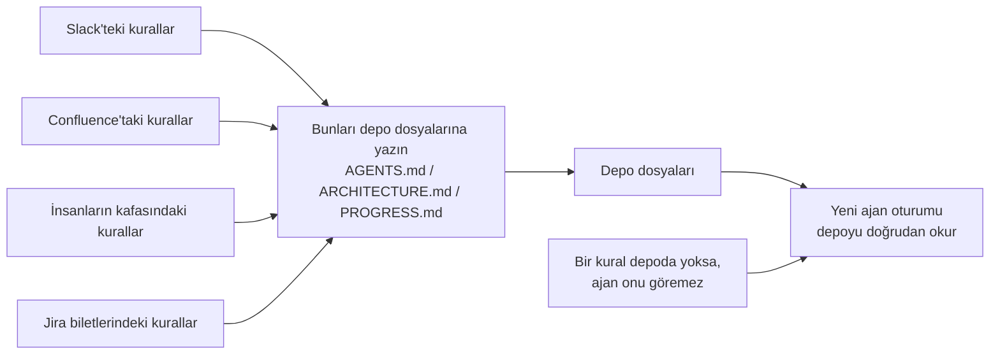
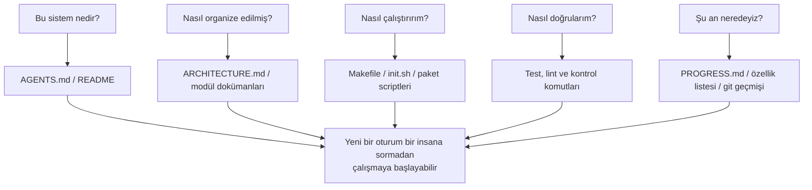

[中文版本 →](../../../zh/lectures/lecture-03-why-the-repository-must-become-the-system-of-record/)

> Kod örnekleri: [code/](https://amitabhakarmakar.github.io/harness-engineering/en/lectures/lecture-03-why-the-repository-must-become-the-system-of-record/code)
> Uygulama projesi: [Proje 02. Ajanın okuyabildiği çalışma alanı](./../../projects/project-02-agent-readable-workspace/)

# Ders 03. Depo neden kayıt sistemi olmalı

Takımınızın mimari kararları Confluence, Slack, Jira ve birkaç kıdemli mühendisin kafasına dağılmış durumda. İnsanlar için bu zar zor işe yarar — bir meslektaşa sorabilirsiniz, sohbet geçmişini arayabilirsiniz, dokümanları kazıyabilirsiniz. Tüm bunlar başarısız olursa, birini mola odasında köşeye sıkıştırabilirsiniz. Ancak bir AI ajanı için, depoda olmayan bilgi basitçe yoktur.

Bu abartı değil. Bir ajanın girdilerinin gerçekten ne olduğunu düşünün: sistem promptları ve görev açıklamaları, depodaki dosya içerikleri ve araç yürütme çıktısı. Hepsi bu. Slack geçmişiniz, Jira biletleriniz, Confluence sayfalarınız ve Cuma öğleden sonra bir meslektaşınızla kahve eşliğinde tartıştığınız o mimari karar — ajan bunların hiçbirini göremez. "Birine gidip soramaz" ya da "sohbet geçmişini arayamaz." Depoya kilitlenmiş bir mühendistir — dışarıdaki her şey hakkında hiçbir şey bilmez.

Yani soru şu: bu mühendise iyi bir harita verecek misiniz?

## Haritaya neler ait

OpenAI bunu açıkça belirtir: **depoda mevcut olmayan bilgi, ajan için mevcut değildir.** Buna "depo şartnamenin kendisidir" ilkesi diyorlar — deponun kendisi en yetkili spesifikasyon belgesidir.

Anthropic'in uzun süre çalışan ajanlar dokümantasyonu bunu yankılar: kalıcı durum uzun görevlerin sürekliliği için gerekli bir koşuldur. Oturumlar arası bilgi kurtarılabilirliği görev başarı oranlarını doğrudan belirler. Ve bu durumun depoda olması gerekir — çünkü ajanın sahip olduğu tek kararlı, erişilebilir depolama budur.

Şöyle düşünebilirsiniz: "Takımımız küçük, bilgi herkesin kafasında ve gayet iyi çalışıyor." Tabii, insanlar için. Ancak bir ajan kullanıyorsanız şu gerçeği kabul edin: ajan insanlara soramaz. Bilmesi gereken her şey yazılı olmalı ve bulabileceği bir yere konmalıdır.

Bu "daha fazla dokümantasyon yazmak" ile ilgili değil. "Karar bilgisini doğru yere koymak" ile ilgili. `src/api/` dizinindeki 50 satırlık bir `ARCHITECTURE.md`, kimsenin bakmadığı Confluence'taki 500 sayfalık bir tasarım belgesinden on bin kat daha kullanışlıdır. Masaya yapıştırılmış el çizimi bir ofis haritası ile dolapta kilitli güzel bir mimari plan arasındaki fark gibi — birincisi ihtiyacınız olduğunda hemen oradadır; ikincisi teknik olarak üstündür ama o an işe yaramazdır.

## Bilgi görünürlüğü



Haritanızın yeterince iyi olup olmadığını nasıl test edersiniz? Bir "soğuk başlatma testi" yapın: yalnızca depo içeriklerini kullanarak yepyeni bir ajan oturumu açın ve beş temel soruya cevap verip veremediğini görün:



Cevap veremiyorsa harita boş noktalara sahiptir. Haritanın boş olduğu yerlerde ajan tahmin yürütür — yanlış tahminler hatalara dönüşür, aşırı tahmin yürütmek bağlamı boşa harcar. Ve her yeni oturum baştan tahmin yürütür. Tahmin yürütmenin maliyeti her zaman en başından haritayı düzgün çizmenin maliyetinden daha yüksektir.

## Temel kavramlar

- **Bilgi görünürlüğü farkı**: Toplam proje bilgisinin depoda OLMAYAN oranı. Fark ne kadar büyükse ajanın başarısızlık oranı da o kadar yüksek olur. Bu proje hakkında ne kadar örtük bilgi sizin kafanızda? Hepsini sayın, sonra ne kadarının depoya dönüştüğünü görün — fark sizin görünürlük farkınızdır.
- **Kayıt sistemi**: Proje kararları, mimari kısıtlamalar, yürütme durumu ve doğrulama standartları için yetkili kaynak olarak kod deposu. Depo son sözü söyler, başka hiçbir yer sayılmaz. "Yol kapalı" yazan bir harita gibi — o yola gitmezsiniz. Ama bu bilgi sadece Eski Zhang'ın kafasında varsa, her seferinde Zhang'a sormak zorundasınızdır.
- **Soğuk başlatma testi**: Yukarıdaki beş soru. Kaç tanesine cevap verebildiği haritanızın ne kadar eksiksiz olduğudur.
- **Keşif maliyeti**: Ajanın depodaki kilit bir bilgiyi bulmak için yaktığı bağlam bütçesi. Bilgi ne kadar gizliyse keşif maliyeti o kadar yüksek olur ve gerçek görev için kalan bütçe o kadar az olur. Kritik bilgiyi on dizin derinliğindeki bir README'de saklamak yangın söndürücüyü bodrumdaki bir kasaya kilitlemek gibidir — vardır, ama ihtiyacınız olduğunda bulamazsınız.
- **Bilgi çürüme oranı**: Birim zaman başına bayatlayan bilgi girişlerinin oranı. Dokümantasyonun kodla senkronize olmaması en büyük düşmandır — hiç dokümantasyon olmamasından daha kötü.
- **ACID benzetmesi**: Veritabanı işlem ilkelerini (Atomicity, Consistency, Isolation, Durability) ajan durum yönetimine uygulamak. Bunu aşağıda genişleteceğiz.

## İyi bir harita nasıl çizilir

**İlke 1: Bilgi kodun yanında yaşar.** API uç noktası kimlik doğrulamasına ilişkin bir kural, devasa bir küresel belgeye gömülmek yerine API kodunun yanına aittir. Her modül dizinine o modülün sorumluluklarını, arayüzlerini ve özel kısıtlamalarını açıklayan kısa bir doküman koyun. Kütüphane rafı etiketleri gibi — tarih kitapları istiyorsanız doğrudan "Tarih" yazan rafa gidin. Tüm kütüphaneyi aramaya gerek yok.

**İlke 2: Standartlaştırılmış bir giriş dosyası kullanın.** `AGENTS.md` (veya `CLAUDE.md`) ajanın "açılış sayfasıdır." Tüm bilgileri içermesi gerekmez ama ajanın üç soruya hızla cevap vermesine olanak tanımalıdır: "Bu proje nedir," "Nasıl çalıştırırım" ve "Nasıl doğrularım." 50-100 satır yeterlidir.

**İlke 3: Minimal ama eksiksiz.** Her bilgi parçasının net bir kullanım durumu olmalıdır. Bir kuralı kaldırmak ajanın karar kalitesini etkilemiyorsa, o kural var olmamalı. Ancak soğuk başlatma testindeki her sorunun bir cevabı olmalıdır. Bu hassas bir dengedir — çok fazla değil, çok az değil, tam olarak yeterli.

**İlke 4: Kod ile güncelleyin.** Bilgi güncellemelerini kod değişikliklerine bağlayın. En basit yaklaşım: mimari dokümanları ilgili modül dizinine koyun. Kodu değiştirdiğinizde dokümanı doğal olarak görürsünüz. Kod değişikliklerinden sonra CI, dokümanların güncellenmesi gerekip gerekmediğini kontrol etmenizi hatırlatabilir.

**Somut depo yapısı**:

```
project/
├── AGENTS.md              # Giriş: proje genel bakışı, çalıştırma komutları, sert kısıtlamalar
├── src/
│   ├── api/
│   │   ├── ARCHITECTURE.md  # API katmanı mimari kararları
│   │   └── ...
│   ├── db/
│   │   ├── CONSTRAINTS.md   # Veritabanı işlem sert kısıtlamaları
│   │   └── ...
│   └── ...
├── PROGRESS.md             # Mevcut ilerleme: tamamlanan, devam eden, engellenen
└── Makefile                # Standart komutlar: setup, test, lint, check
```

## Ajan durumunu ACID ilkeleriyle yönetmek

Bu benzetme veritabanı işlem yönetiminden gelir — fazla karmaşıklaştırmak gibi gelebilir ama aslında çok pratik bir çerçeve sunar:

- **Atomicity (Atomik olma)**: Her "mantıksal işlem" (örneğin, "yeni uç nokta ekle ve testleri güncelle") bir git commit alır. Ortada başarısız olursa geri almak için `git stash`. Hep ya da hiç — "yarım yapılmış" olmaz.
- **Consistency (Tutarlılık)**: "Tutarlı durum" doğrulama yüklemlerini tanımlayın — tüm testler geçer, lint sıfır hata raporlar. Ajan her işlemden sonra doğrulama çalıştırır; tutarsız ara durumlar commit edilmez. Banka havalesi gibi — kredilendirmeden borçlandırma yapamazsınız.
- **Isolation (İzolasyon)**: Birden fazla ajan eşzamanlı çalıştığında, durum dosyalarını yarış koşullarından kaçınmak için tasarlayın. Basit yaklaşım: her ajan kendi ilerleme dosyasını kullanır veya izolasyon için git dallarını kullanır. İki aşçı aynı tencereye eşzamanlı baharat ekleyemez — aşırı tuzlanırsa kim sorumluluk alır?
- **Durability (Kalıcılık)**: Kritik proje bilgisi git tarafından izlenen dosyalarda yaşar. Geçici durum oturum belleğinde kalabilir, ancak oturumlar arası bilgi dosyalara kalıcılaştırılmalıdır. Kafanızdaki şey sayılmaz — yalnızca kağıttaki sayılır.

## Gerçek bir dönüşüm hikâyesi

Bir takım ~30 mikroservise sahip bir e-ticaret platformunu sürdürüyordu. Mimari kararlar (servisler arası iletişim protokolleri, veri tutarlılığı stratejileri, API versiyonlama kuralları) şu yerlere dağılmıştı: Confluence (kısmen güncelliğini yitirmiş), Slack (aranması zor), birkaç kıdemli mühendisin kafası (ölçeklenemez) ve düzensiz kod yorumları (sistematik değil).

AI ajanlarını tanıttıktan sonra görevlerin %70'i insan müdahalesi gerektirdi. Hemen her başarısızlık ajanın "herkesin bildiği ama kimsenin yazmadığı" örtük bir kısıtlamayı ihlal etmesini içeriyordu. Kimsenin "öğle yemeği siparişini grup sohbetine yazmalısın" demediği yeni bir çalışan gibi — yanlış tahmin ederler, azarlanırlar ama azarlandıktan sonra hâlâ kimse kuralı söylemez.

Takım bir dönüşüm gerçekleştirdi:
1. Depo kökünde proje genel bakışı, teknoloji yığını sürümleri ve küresel sert kısıtlamalar içeren `AGENTS.md` oluşturuldu
2. Her mikroservis dizinine sorumlulukları, arayüzleri ve bağımlılıkları açıklayan `ARCHITECTURE.md` eklendi
3. Açık "OLMALI/OLMAMALI" dilinde sert kısıtlamalar içeren merkezi bir `CONSTRAINTS.md` oluşturuldu
4. Mevcut iş durumunu takip eden `PROGRESS.md` her servis dizinine eklendi

Dönüşümden sonra: aynı ajan soğuk başlatmada tüm temel proje sorularına cevap verebildi ve görev tamamlanma kalitesi önemli ölçüde iyileşti.

## Önemli çıkarımlar

- Depoda olmayan bilgi ajan için yoktur. Kritik kararları depoya koymak en temel harness yatırımıdır — iyi bir harita çizin ki kaybolmayasınız.
- Depo kalitesini değerlendirmek için "soğuk başlatma testini" kullanın: yeni bir oturum yalnızca depo içeriklerini kullanarak beş temel soruya cevap verebiliyor mu?
- Bilgi kodun yakınında olmalı, minimal ama eksiksiz olmalı ve kodla güncellenmelidir. Konu daha fazla doküman yazmak değil — bilgiyi doğru yere koymakla ilgili.
- Ajan durumu için ACID ilkelerini kullanın: atomik commit'ler, tutarlılık doğrulaması, eşzamanlılık izolasyonu, kritik bilginin kalıcılığı.
- Bilgi çürümesi en büyük düşmandır. Kodla senkron olmayan dokümantasyon hiç dokümantasyon olmamasından daha tehlikelidir — ajanı doğru olduğunu sanırken yanlış yöne gönderir.

## Daha fazla okuma

- [OpenAI: Harness Engineering](https://openai.com/index/harness-engineering/)
- [Anthropic: Effective Harnesses for Long-Running Agents](https://www.anthropic.com/engineering/effective-harnesses-for-long-running-agents)
- [Infrastructure as Code — Martin Fowler](https://martinfowler.com/bliki/InfrastructureAsCode.html)
- [ADR: Architecture Decision Records](https://adr.github.io/)
- [The Twelve-Factor App](https://12factor.net/)

## Alıştırmalar

1. **Soğuk başlatma testi**: Projenizde tamamen yeni bir ajan oturumu açın (sözlü bağlam yok, yalnızca depo içerikleri). Ona beş soru sorun: Bu sistem nedir? Nasıl organize edilmiş? Nasıl çalıştırırım? Nasıl doğrularım? Mevcut ilerleme nedir? Cevap veremediklerini kaydedin, ardından cevap verebilene kadar depoyu iyileştirin.

2. **Bilgi dışsallaştırma ölçümü**: Projenizde geliştirme çalışması için önemli olan tüm kararları ve kısıtlamaları listeleyin. Her birini depo içinde mi yoksa dışında mı olarak işaretleyin. Bilgi görünürlük farkınızı hesaplayın (depo dışı oranı). %10'un altına indirmek için bir plan yapın.

3. **ACID değerlendirmesi**: Bu dersin ACID benzetmesini kullanarak projenizin durum yönetimini değerlendirin. Atomik olma — ajan işlemleri temiz şekilde geri alınabilir mi? Tutarlılık — "tutarlı durum" doğrulaması var mı? İzolasyon — eşzamanlı ajanlar birbirinin ayağına basıyor mu? Kalıcılık — tüm oturumlar arası bilgi kalıcılaştırılmış mı?
