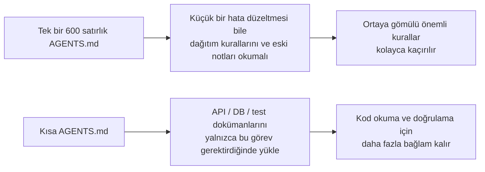
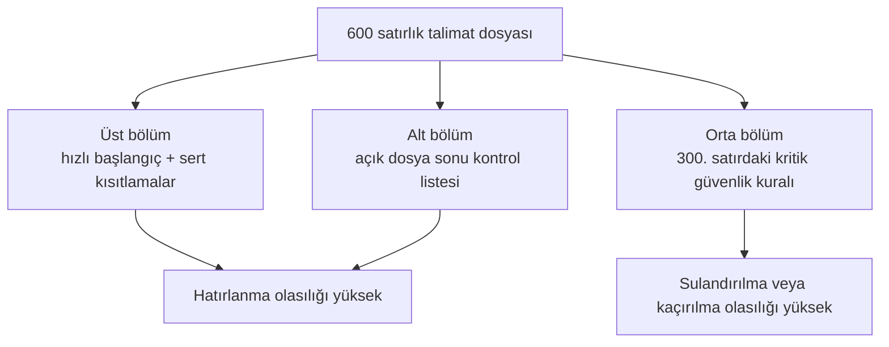

[中文版本 →](../../../zh/lectures/lecture-04-why-one-giant-instruction-file-fails/)

> Kod örnekleri: [code/](https://letslego.github.io/harness-engineering/en/lectures/lecture-04-why-one-giant-instruction-file-fails/code)
> Uygulama projesi: [Proje 02. Ajanın okuyabildiği çalışma alanı](./../../projects/project-02-agent-readable-workspace/)

# Ders 04. Tek bir dev talimat dosyası neden yetmez

Harness mühendisliğini ciddiye aldınız — aferin size. Bir `AGENTS.md` oluşturdunuz ve aklınıza gelen her kural, kısıtlama ve öğrenilen dersi içine tıktınız. Bir ay sonra dosya 300 satıra, iki ay sonra 450 satıra, üç ay sonra 600 satıra şişti. Sonra ajan performansının aslında kötüleştiğini fark ettiniz — basit bir hata düzeltmesinde ajan ilgisiz dağıtım talimatlarını işlemek için bolca bağlam yakıyor; 300. satıra gömülü kritik bir güvenlik kısıtlaması doğrudan göz ardı ediliyor; üç çelişkili kod stili kuralı ajanın her seferinde rastgele birini seçmesi anlamına geliyor.

Bu "dev talimat dosyası" tuzağıdır. Bir bavulu fazla doldurmak gibidir — her şey faydalı görünür, hepsini sıkıştırırsınız fermuar patlamak üzeredir. İç çamaşırı bulmak tüm çantayı boşaltmak anlamına gelir. Dolu bir bavul taşıdınız ama aslında içindekilerin belki üçte birini kullandınız.

## Kök nedendeki kısır döngü

En yaygın kısır döngü şöyle ilerler: ajan bir hata yapar, siz "bunu önleyecek bir kural ekleyin" dersiniz, AGENTS.md'ye eklersiniz, geçici olarak işe yarar, ajan farklı bir hata yapar, başka bir kural eklersiniz, tekrarlayın, dosya kontrolden çıkıp şişer.

Bu sizin hatanız değil. Çok doğal bir tepkidir — her şey ters gittiğinde "bir kural ekle" makul gelir, evden çıkarken her seferinde "ne olur ne olmaz" diye çantaya bir şey daha atmak gibi. Ancak birikimli etki felakettir. Ne sıkıntı çıktığına ayrıntılı bakalım.

**Bağlam bütçesi cabuk tükenir.** Ajanın bağlam penceresi sonludur. Diyelim ki ajanınızın 200K token penceresi var (Claude'un standardı). Şişmiş bir talimat dosyası 10-20K token yiyebilir. Hâlâ bol yer var gibi mi görünüyor? Ama karmaşık bir görev onlarca kaynak dosya okumaya ihtiyaç duyabilir, araç yürütme çıktısı da bağlam alır ve konuşma geçmişi birikir. Ajanın kodu anlaması gerektiğinde bütçe zaten sıkışıktır — "ne olur ne olmaz" eşyalarıyla o kadar doldurulmuş bir bavul ki dizüstü bilgisayarınıza yer kalmamış.

**Ortada kaybolur.** "Lost in the Middle" makalesi (Liu et al., 2023) LLM'lerin uzun metinlerin ortasındaki bilgiyi başlangıç veya sondaki bilgiye göre önemli ölçüde daha az etkili kullandığını açıkça gösterdi. AGENTS.md'niz 600 satır ve 300. satırda "tüm veritabanı sorguları parametreli sorgular kullanmalı" yazıyor — bu bir güvenlik sert kısıtlamasıdır. Ama ortaya gömüldü, ajan neredeyse kesinlikle bunu göz ardı edecek. Fazla doldurulmuş bavulun dibindeki güneş kremi şişesi gibi — orada olduğunu biliyorsunuz, üç kez kazıyorsunuz, bulamıyorsunuz, sonunda bir tane daha alıyorsunuz.

**Öncelik çakışmaları.** Dosya pazarlık edilemez sert kısıtlamaları ("asla eval() kullanma"), önemli tasarım yönergelerini ("işlevsel stili tercih et") ve belirli bir tarihsel dersi ("geçen hafta bir WebSocket bellek sızıntısını düzelttim, benzer kalıplara dikkat et") karıştırır. Bu üç kuralın tamamen farklı önem seviyeleri vardır ama dosyada aynı görünürler. Ajanın bunları ayırt etmek için güvenilir bir sinyali yoktur — pasaportunuz ve şarj kablonuz bavulda karışmış gibi, hangisinin daha acil olduğunu söylemenin yolu yoktur.

**Bakım çürümesi.** Büyük dosyaların bakımı doğal olarak zordur. Bayatlamış talimatlar nadiren silinir — çünkü silmenin sonuçları belirsizdir ("belki başka bir şey bu kurala bağlıdır?"), yeni talimatlar eklemek ise ücretsiz hissettirir. Sonuç: dosya yalnızca büyür, asla küçülmez ve sinyal-gürültü oranı sürekli düşer. Bu tam olarak yazılımdaki teknik borç birikimi gibidir.

**Çelişki birikimi.** Farklı zamanlarda eklenen talimatlar birbiriyle çelişmeye başlar — biri "TypeScript strict mode kullanın" der, diğeri "bazı eski dosyalar any tiplerine izin verir" der. Ajan her seferinde rastgele birini takip eder. Annenizin "sıkı giyin" demesi, babanızın "çok kalın giyme" demesi gibi, siz de kapıda kime kulak vereceğinizi bilmeden duruyorsunuz.

## Temel kavramlar

- **Talimat şişmesi**: Bir talimat dosyası bağlam penceresinin %10-15'inden fazlasını işgal ettiğinde, kod okuma ve görev muhakemesi bütçesini sıkıştırmaya başlar. 600 satırlık bir `AGENTS.md` 10.000-20.000 token tüketebilir — bu, ajan başlamadan önce 128K pencerenin %8-15'ini tüketir.
- **Ortada kaybolma etkisi**: Liu et al.'in 2023 araştırması, LLM'lerin uzun metinlerin ortasındaki bilgiyi başlangıç veya sondaki bilgiye göre önemli ölçüde daha az etkili kullandığını kanıtladı. 600 satırlık bir dosyanın 300. satırına gömülü kritik bir kısıtlamanın etkili olarak göz ardı edilme olasılığı çok yüksektir.
- **Talimat sinyal-gürültü oranı (SNR)**: Bir dosyadaki mevcut göreve ilişkin talimatların oranı. Bir hata düzeltmesi sırasında 50 satırlık dağıtım talimatı okumaya zorlanmak — bu düşük SNR'dir.
- **Yönlendirme dosyası**: Temel işlevi ajanı daha ayrıntılı dokümanlara yönlendirmek olan, her şeyi içermeyen kısa bir giriş dosyası. 50-200 satır yeterli olur.
- **Aşamalı açıklama (Progressive Disclosure)**: Önce genel bakış bilgisi verin, ihtiyaç duyulduğunda ayrıntılı bilgi verin. İyi harness tasarımı iyi UI tasarımı gibidir — tüm seçenekleri kullanıcıya bir anda dökmeyin.
- **Öncelik belirsizliği**: Tüm talimatlar aynı formatta ve konumda göründüğünde ajan pazarlık edilemez sert kısıtlamaları öneri niteliğindeki yumuşak yönergelerden ayıramaz.

## Talimat mimarisi





## Nasıl bölünür

Temel ilke: sık ihtiyaç duyulan bilgiyi elinizin altında tutun, ara sıra ihtiyaç duyulan bilgiyi bir kenara koyun ve asla kullanmayacağınızı geride bırakın.

Giriş dosyası `AGENTS.md` 50-200 satırda kalır ve yalnızca en sık kullanılan öğeleri içerir — proje genel bakışı (bir veya iki cümle), ilk çalıştırma komutları (`make setup && make test`), küresel sert kısıtlamalar (15'ten fazla pazarlık edilemez kural değil) ve konu dokümanlarına bağlantılar (tek satırlık açıklama + uygulanabilirlik koşulu).

```markdown
# AGENTS.md

## Proje Genel Bakışı
Python 3.11 FastAPI backend, PostgreSQL 15 veritabanı.

## Hızlı Başlangıç
- Kurulum: `make setup`
- Test: `make test`
- Tam doğrulama: `make check`

## Sert Kısıtlamalar
- Tüm API'ler OAuth 2.0 kimlik doğrulaması kullanmalı
- Tüm veritabanı sorguları SQLAlchemy 2.0 sözdizimini kullanmalı
- Tüm PR'lar pytest + mypy --strict + ruff check'i geçmeli

## Konu Dokümanları
- API Tasarım Kalıpları (`docs/api-patterns.md`) — Uç nokta eklerken okunması zorunlu
- Veritabanı Kuralları (`docs/database-rules.md`) — Veritabanı işlemleri değiştirilirken zorunlu
- Test Standartları (`docs/testing-standards.md`) — Test yazarken referans
```

Her konu dokümanı 50-150 satırdır, `docs/` dizininde veya ilgili modülün yanında konuya göre organize edilmiştir. Ajan bunları yalnızca gerektiğinde okur. Bavuldaki paket küpleri gibi — bir küpte iç çamaşırı, diğerinde tuvalet malzemeleri, üçüncüsünde şarj cihazları. Bir şey bulmak tüm çantayı boşaltmayı gerektirmez.

Bazı bilgiler doğrudan koda koymak için daha iyidir — tip tanımları, arayüz yorumları, yapılandırma dosyalarındaki açıklamalar. Ajan kodu okurken bunları doğal olarak görür, talimatlarda tekrarlamaya gerek yoktur.

Her talimatın bir kaynağı ("bu kural neden eklendi?"), bir uygulanabilirlik koşulu ("bu kural ne zaman gerekli?") ve bir sona erme koşulu ("hangi koşullar altında bu kural kaldırılabilir?") olmalıdır. Düzenli denetim yapın, bayatlamış, gereksiz ve çelişkili girişleri kaldırın. Talimatlarınızı kod bağımlılıklarınızı yönettiğiniz gibi yönetin — kullanılmayan bağımlılıklar silinmeli, aksi takdirde sadece sistemi yavaşlatırlar.

Bir talimat giriş dosyasında olmak zorundaysa, üste veya alta koyun — asla ortaya değil. "Ortada kaybolma" etkisi bize LLM'lerin uç noktalardaki bilgiyi merkezdekinden önemli ölçüde daha iyi kullandığını söyler. Ancak daha iyi yaklaşım talimatları talep üzerine yükleme için konu dokümanlarına taşımaktır.

Hem OpenAI hem de Anthropic örtük olarak bölme yaklaşımını destekler. OpenAI giriş dosyalarının "kısa ve yönlendirme odaklı" olması gerektiğini söyler, Anthropic uzun süre çalışan ajan kontrol bilgisinin "özlü ve yüksek öncelikli" olması gerektiğini söyler. Her ikisi de aynı şeyi söylüyor: her şeyi tek bir dosyaya tıkmayın. Bir bavulun organize edilmesi gerekir, sadece kaba kuvvetle tıkıştırılmasının değil.

## Gerçek dünya örneği

Bir SaaS takımının `AGENTS.md`'si 50 satırdan 600'e şişti. İçerik teknoloji yığını sürümlerini, kod standartlarını, tarihsel hata düzeltme notlarını, API kullanım kılavuzlarını, dağıtım prosedürlerini ve takım üyelerinin kişisel tercihlerini karıştırıyordu — bavul tıkırtıya kadar dolmuştu.

Ajan performansı dikkat çekici şekilde düşmeye başladı: basit hata düzeltmeleri sırasında ajan ilgisiz dağıtım talimatlarını işlemek için bolca bağlam harcadı; "tüm veritabanı sorguları parametreli sorgular kullanmalı" güvenlik kısıtlaması 300. satıra gömülmüştü ve sık sık göz ardı ediliyordu; üç çelişkili kod stili kuralı ajanın rastgele davranmasına neden oluyordu.

Takım bir "bavul yeniden düzenleme" gerçekleştirdi:
1. `AGENTS.md` 80 satıra indirildi: yalnızca proje genel bakışı, çalıştırma komutları ve 15 küresel sert kısıtlama
2. Konu dokümanları oluşturuldu: `docs/api-patterns.md` (120 satır), `docs/database-rules.md` (60 satır), `docs/testing-standards.md` (80 satır)
3. Yönlendirme dosyasına konu dokümanı bağlantıları eklendi
4. Tarihsel notlar ya test senaryolarına dönüştürüldü ya da silindi

Yeniden yapılandırmadan sonra: aynı görev setinin başarı oranı %45'ten %72'ye çıktı. Güvenlik kısıtlaması uyumu %60'tan %95'e çıktı — çünkü dosyanın ortasından yönlendirme dosyasının üstüne taşındı, artık "ortada kaybolmuyor."

## Önemli çıkarımlar

- "Bir kural ekle" kısa vadeli ağrı kesicidir, uzun vadeli zehirdir. Bir kural eklemeden önce sorun: bu bir konu dokümanında daha iyi olur mu? Sadece bavula şeyleri tıkıştırmaya devam etmeyin.
- Giriş dosyası bir yönlendiricidir, ansiklopedi değildir. 50-200 satır, yalnızca genel bakış, sert kısıtlamalar ve bağlantılar.
- "Ortada kaybolma" etkisinden yararlanın: önemli bilgi üste veya alta gider; önemsiz bilgi konu dokümanlarına taşınır.
- Talimat şişmesini teknik borç gibi yönetin. Düzenli denetimler, her talimatın bir kaynağı, uygulanabilirlik koşulu ve sona erme koşulu olmalıdır.
- Bölmeden sonra SNR iyileşir ve ajan ilgisiz talimatları işlemek yerine gerçek görevlere daha fazla bağlam bütçesi harcar.

## Daha fazla okuma

- [OpenAI: Harness Engineering](https://openai.com/index/harness-engineering/)
- [Anthropic: Effective Harnesses for Long-Running Agents](https://www.anthropic.com/engineering/effective-harnesses-for-long-running-agents)
- [Lost in the Middle: How Language Models Use Long Contexts](https://arxiv.org/abs/2307.03172)
- [HumanLayer: Harness Engineering for Coding Agents](https://humanlayer.dev/articles/harness-engineering-for-coding-agents/)
- [Nielsen Norman Group: Progressive Disclosure](https://www.nngroup.com/articles/progressive-disclosure/)

## Alıştırmalar

1. **SNR denetimi**: Mevcut giriş talimat dosyanızı alın ve tüm talimat girişlerini listeleyin. 5 farklı yaygın görev türü seçin ve her talimatın o görevle ilgili olup olmadığını işaretleyin. Her görev türü için SNR hesaplayın. Çoğu görev için gürültü olan talimatlar konu dokümanlarına taşınmalıdır.

2. **Aşamalı açıklama yeniden yapılandırması**: 300 satırdan büyük bir talimat dosyanız varsa, bunu şu şekilde bölün: (a) 100 satırın altında bir yönlendirme dosyası, (b) 3-5 konu dokümanı. Aynı görev setini (en az 5) öncesi ve sonrası çalıştırın, başarı oranlarını karşılaştırın.

3. **Ortada kaybolma doğrulaması**: Uzun bir talimat dosyasında kritik bir kısıtlamayı sırasıyla üste, ortaya ve alta yerleştirin, her seferinde aynı görev setini (her konum için en az 5 koşu) çalıştırın. Uyum oranında bir fark olup olmadığını görün. Konum etkisinin ne kadar güçlü olduğuna şaşırabilirsiniz.
