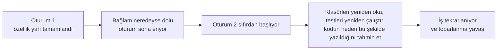
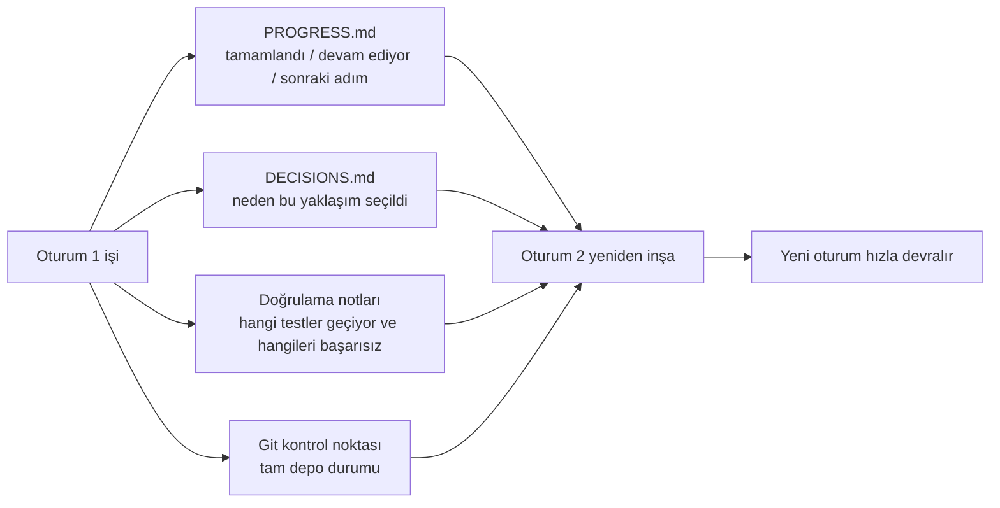

[中文版本 →](../../../zh/lectures/lecture-05-why-long-running-tasks-lose-continuity/)

> Kod örnekleri: [code/](https://amitabhakarmakar.github.io/harness-engineering/en/lectures/lecture-05-why-long-running-tasks-lose-continuity/code)
> Uygulama projesi: [Proje 03. Çok oturumlu süreklilik](./../../projects/project-03-multi-session-continuity/)

# Ders 05. Uzun süren görevler neden sürekliliği kaybeder

Claude Code'dan eksiksiz bir özellik uygulamasını istiyorsunuz. 30 dakika çalışıyor, işin çoğunu yapıyor ama bağlam tükenmek üzere. Devam etmek için yeni bir oturum başlatıyorsunuz — ve geçen sefer hangi kararların alındığını, A seçeneği yerine neden B'nin seçildiğini, hangi dosyaların değiştirildiğini veya testlerin ne durumda olduğunu hatırlamadığını fark ediyorsunuz. Projeyi yeniden keşfetmek için 15 dakika harcıyor ve önceki yaklaşımla tutarsız olabiliyor.

Her sabah uyandığında her şeyi unutan bir zanaatkâr olduğunuzu hayal edin. Tüm inşaat sahasıyla yeniden tanışmak zorunda kalırdınız — hangi duvar yarı yapılmış, kırmızı tuğla neden mavi yerine seçilmiş, su tesisatı nereye ulaşmış. Daha kötüsü, dün takılmış bir pencereyi sadece yapıldığını hatırlamadığınız için söküp atabilirsiniz.

AI kod yazma ajanlarının oturumlar arası görevlerde tam olarak karşılaştığı çıkmaz budur. Bu ders ajanların uzun görevler sırasında neden "karardığını" ve yapılandırılmış durum kalıcılığının onları güvenilir bir günlük tutan bir zanaatkâr gibi nasıl yapabileceğini açıklıyor — hâlâ unutkan, ama günlük her şeyi hatırlıyor.

## Bağlam pencereleri: sonsuz değil

Bağlam pencereleri sonludur. Bu model yükseltmeleriyle çözülebilir bir şey değildir — pencere boyutları 1M tokene ulaşsa bile karmaşık görevler yine tüketecek. Çünkü ajanlar sadece kod üretmiyor; kod tabanlarını anlıyor, kendi karar geçmişlerini takip ediyor, araç çıktısını işliyor ve konuşma bağlamını koruyor. Tüm bu bilgiler pencere genişlemesinden daha hızlı büyüyor.

Daha derin bir sorun: ajanın ürettiği bilgi tek tip önemde değildir. Ara muhakeme adımları kararların "nedenlerini" içerir — A yerine B seçeneği neden seçildi, neden bu kütüphane yerine şu, neden belirli bir optimizasyon atlandı. Nihai çıktı yalnızca "neyi" içerir — kodun kendisi. Sıkıştırma stratejileri genellikle ikincisini korur ama birincisini kaybeder. Sonraki oturum kodu görür ama neden böyle yazıldığını bilmez ve kasıtlı bir tasarım kararını "optimize" ederek kaldırabilir.

Anthropic uzun süre çalışan ajan araştırmalarında ilginç bir şey keşfetti: ajanlar bağlamın azaldığını sezdiğinde "erken yakınsama" davranışı sergiler — mevcut işi bitirmek için acele eder, doğrulama adımlarını atlar veya optimal yerine basit bir çözüm seçer. Sınavda zamanın tükendiğini fark edip kalan çoktan seçmelilerde hızla tahmin yapmak gibidir. Anthropic buna "bağlam kaygısı" diyor.

## Oturum süreklilik akışı

Süreklilik artefaktları olmadan her yeni oturum bir felakettir:



Süreklilik artefaktlarıyla yeni oturumlar hızlıca devralabilir:



## Temel kavramlar

- **Bağlam pencereleri sonludur**: Hangi pencere boyutu iddia edilirse edilsin (128K, 200K, 1M), uzun görevler sonunda bunları tüketecektir. Tüketildikten sonra ya sıkıştırma (bilgi kaybı) ya da sıfırlama (yeni oturum) gerekir. Her ikisi de bir şey kaybeder.
- **Süreklilik artefaktları**: Yeni bir oturumun geçen oturumun bıraktığı yerden net bir şekilde devam etmesini sağlayan kalıcılaştırılmış durum dosyaları. Temel form: ilerleme günlüğü + doğrulama kaydı + sonraki eylemler. O zanaatkârın günlüğü.
- **Yeniden inşa maliyeti**: Yeni bir oturumun yürütülebilir bir duruma ulaşması için gereken süre. İyi harness'lar yeniden inşa maliyetini 15 dakikadan 3 dakikaya sıkıştırabilir.
- **Sürüklenme (Drift)**: Ajanın anlayışı ile kod deposunun gerçek durumu arasındaki fark. Her oturum sınırı sürüklenme getirir; kontrol olmadan birikir.
- **Bağlam kaygısı**: Anthropic tarafından gözlemlenen bir olgu — ajanlar algılanan bağlam sınırlarına yaklaştıklarında bilgi kaybını önlemek için görevleri erken bitirerek erken yakınsama davranışı sergiler. Bu mantıksız bir kaynak kaygısıdır.
- **Sıkıştırma vs sıfırlama**: Sıkıştırma aynı oturum içinde bağlamı özetler ("neyi" tutar, "neden"i kaybedebilir); sıfırlama kalıcılaştırılmış durumdan yeniden inşa eden yeni bir oturum açar (temiz ama artefakt eksiksizliğine bağımlıdır).

## Süreklilik koptuğunda ne olur

Önceki oturum üç yaklaşımı analiz etmek ve B seçeneğini seçmek için önemli bir bağlam bütçesi harcadı. Bu oturumun ajanı o analizi bilmiyor ve eksik bilgiye dayanarak yeniden karar verebilir — potansiyel olarak A seçeneğini seçebilir. Kırmızı tuğlaların neden seçildiğini hatırlamayan unutkan zanaatkâr gibi, bugün mavi olanlara bakar ve daha güzel olduklarını düşünür, dünkü duvarı söküp yeniden inşa eder.

Daha da kötüsü tekrar eden iştir. Ajan belirli işlerin tamamlanıp tamamlanmadığından emin değildir ve onları tekrar yapar. Ya da daha kötüsü — yarısını yapar, mevcut uygulamayla bir çakışma keşfeder ve yeniden çalışmak zorunda kalır. Bir inşaat sahasında iki ekip aynı duvarı eşzamanlı olarak inşa edemez — ancak ilerleme kayıtları olmadan, yeni ekip birinin zaten üzerinde çalıştığını bilmez.

Birkaç oturum boyunca uygulama yönü sessizce orijinal gereksinimlerden sapmış olabilir. Her yeni oturum proje hedeflerini biraz farklı anlar. Telefon oyunu gibi — on kişi mesajı geçirdikten sonra "bana bir kahve al" "bana bir kahve makinesi al"a dönüşebilir.

Bir de doğrulama farkı var. Önceki oturumun doğrulama sonuçları (hangi testler geçti, hangileri başarısız oldu, neden başarısız oldular) kaydedilmedi. Yeni oturum mevcut durumu anlamak için tüm doğrulamayı yeniden çalıştırmak zorundadır. Her oturum sıfırdan yeniden tanı koyar, her seferinde değerli bağlamı boşa harcar.

Hem OpenAI hem de Anthropic dokümantasyonlarında yapılandırılmış durum kalıcılığını vurgular. OpenAI'nin harness mühendisliği makalesi depoyu bir "operasyonel kayıt" olarak ele alır — her işlemin sonuçları depoda izlenebilir kanıt bırakmalıdır. Anthropic'in uzun süre çalışan ajanlar dokümantasyonu özellikle "devir dosyaları" önerir — mevcut durumu, bilinen sorunları ve sonraki eylemleri içeren yapılandırılmış belgeler.

## Unutkan zanaatkâr için bir günlük

Temel yaklaşım: **Ajanı amnezili harika bir mühendis gibi ele alın.** "İş çıkışı yapmadan" önce, kritik bilgileri yazması gerekir ki bir sonraki "vardiya" ajanı hızla devralabilsin.

**Araç 1: İlerleme dosyası (PROGRESS.md).** En temel süreklilik artefaktı — günlüğün özü:

```markdown
# Proje İlerlemesi

## Mevcut Durum
- Son commit: abc1234 (feat: add user preferences endpoint)
- Test durumu: 42/43 geçti (test_pagination_edge_case başarısız)
- Lint: geçti

## Tamamlandı
- [x] Kullanıcı modeli ve veritabanı geçişi
- [x] Temel CRUD uç noktaları
- [x] Kimlik doğrulama middleware entegrasyonu

## Devam Ediyor
- [ ] Sayfalama özelliği (%90 - kenar durum testi başarısız)

## Bilinen Sorunlar
- test_pagination_edge_case boş sonuç kümelerinde 500 döndürüyor
- Silinmiş kullanıcıların listelemelerde görünmesi gerekip gerekmediğini doğrulamalı

## Sonraki Adımlar
1. Sayfalama kenar durum hatasını düzelt
2. "Silinmiş kullanıcıları dahil et" sorgu parametresi ekle
3. API dokümantasyonunu güncelle
```

**Araç 2: Karar günlüğü (DECISIONS.md).** Önemli tasarım kararlarını ve nedenlerini kaydedin. Ayrıntılı tasarım belgelerine gerek yok — sadece "hangi karar, neden, ne zaman" — günlükteki notlar:

```markdown
# Tasarım Kararları

## 2024-01-15: Kullanıcı tercihleri önbellekleme için Redis kullan
- Gerekçe: Yüksek okuma sıklığı (her API çağrısında), küçük veri boyutu
- Reddedilen alternatif: PostgreSQL materialized view (yüksek değişim sıklığı bakım maliyetini değer kılmaz)
- Kısıt: 5 dakikalık önbellek TTL, yazmada aktif geçersiz kılma
```

**Araç 3: Kontrol noktası olarak git commit'leri.** Her atomik iş birimini tamamladıktan sonra commit edin. Commit mesajları ne yapıldığını ve neden yapıldığını açıklamalıdır. Bunlar ücretsiz, otomatik olarak versiyonlanmış durum anlık görüntüleridir.

**Araç 4: init.sh veya harness başlatma akışı.** `AGENTS.md`'de "iş başı" ve "iş çıkışı" rutinlerini belirtin:

```markdown
## Oturum başlangıcında (iş başı)
1. Mevcut durum için PROGRESS.md'yi oku
2. Önemli kararlar için DECISIONS.md'yi oku
3. Deponun tutarlı durumda olduğunu doğrulamak için make check çalıştır
4. PROGRESS.md "Sonraki Adımlar" bölümünden devam et

## Oturum sonundan önce (iş çıkışı)
1. PROGRESS.md'yi güncelle
2. Tutarlı durumu doğrulamak için make check çalıştır
3. Tamamlanmış tüm işleri commit et
```

**Karma strateji**: Her görev bir bağlam sıfırlamasına ihtiyaç duymaz. Kısa görevler (30 dakikanın altında) bir oturum içinde tamamlanabilir. Uzun görevler (oturumlara yayılan) süreklilik için ilerleme dosyaları ve karar günlükleri kullanmalıdır. Karar kriteri: bir görev pencerenin %60'ından fazlasına ihtiyaç duyuyorsa devri hazırlamaya başlayın.

### Bağlam kaygısına derin bakış

Anthropic'in Mart 2026 araştırması bağlam kaygısının spesifik tezahürlerini daha da ortaya çıkardı: Sonnet 4.5'te bağlam pencere sınırına yaklaştığında ajan güçlü bir "erken yakınsama" davranışı gösterir. Sınavda zamanın neredeyse dolduğunu fark edip çoktan seçmelilere hızla rastgele cevaplar yazmak gibidir.

İki strateji bunu ele alır:

**Sıkıştırma**: Aynı oturum içinde erken konuşmayı özetlemek. Avantaj: sürekliliği korur, ajan "neyi" görebilir. Dezavantaj: "neden" genellikle özetlerde kaybolur — A yerine B seçeneği neden seçildi, belirli bir optimizasyon neden atlandı. Daha kritik olarak, sıkıştırma bağlam kaygısını ortadan kaldırmaz — ajan bir zamanlar bağlamın büyük olduğunu bilir ve psikolojik olarak hâlâ kapanışa acele etme eğilimindedir.

**Bağlam sıfırlaması**: Bağlamı tamamen temizlemek, yeni bir oturum açmak, kalıcılaştırılmış artefaktlardan yeniden inşa etmek. Avantaj: temiz zihinsel durum — yeni oturumun "zamanım tükeniyor" kaygısı yok. Dezavantaj: devir artefaktlarının eksiksizliğine bağımlıdır. Günlük kritik bilgileri kaçırıyorsa, yeni oturum yanlış yöne giderek zaman kaybedebilir.

Anthropic'in gerçek verileri: Sonnet 4.5 için bağlam kaygısı tek başına sıkıştırmanın yeterli olmayacak kadar şiddetlidir — bağlam sıfırlaması harness tasarımının kritik bir bileşeni hâline gelir. Ancak Opus 4.5 için bu davranış büyük ölçüde azalır ve sıkıştırma sıfırlamalara güvenmeden bağlamı yönetebilir. Bu şu anlama gelir: **harness tasarımı tek bir kalıp değil, hedef modelin spesifik bir anlayışını gerektirir.**

> Kaynak: [Anthropic: Harness design for long-running application development](https://www.anthropic.com/engineering/harness-design-long-running-apps)

## Gerçek dünya örneği

Bir ajana kullanıcı kimlik doğrulamasıyla birlikte bir blog sistemi uygulama görevi verildi — 12 özellik noktası, tahmini 5 oturum gerekiyor.

**Günlük olmadan başlangıç**: Oturum 1 kullanıcı modelini ve temel rotaları uyguladı. Oturum 2, ajan kimlik doğrulama middleware'inin arayüz sözleşmesini hatırlamadan başladı, önceki tasarım niyetini çıkarmak için ~15 dakika harcadı. Oturum 3'e gelindiğinde, birikmiş sürüklenme ajanın zaten tamamlanmış özellikleri yeniden uygulamaya başlamasına neden oldu. Oturum 5'e gelindiğinde depo birçok gereksiz kod içeriyordu ama temel kimlik doğrulama özelliği hâlâ uçtan uca testleri geçmemişti. 12 özellik noktasından sadece 7'si tamamlandı, 3'ü gizli doğruluk sorunlarına sahipti. Günlüğüne hiç yazmayan zanaatkâr gibi — beşinci güne gelindiğinde inşaat sahası kaos hâlinde, bazı duvarlar iki kez yapılmış, yapılması gereken bazıları hiç başlamamış.

**Günlükle**: İlerleme dosyaları, karar günlükleri, doğrulama kayıtları ve git kontrol noktaları kullanılarak. Her oturum sonunda durum raporu otomatik olarak güncellendi. Oturum 2'nin yeniden inşa maliyeti ~3 dakikaya düştü. Oturum 5'e gelindiğinde, 12 özellik noktasının tümü tamamlandı ve doğrulandı.

Nicel karşılaştırma: yeniden inşa süresi ~%78 azaldı, özellik tamamlanma oranı %58'den %100'e çıktı, gizli kusur oranı %43'ten %8'e düştü. Zanaatkâr hâlâ unutkan, ancak günlükle her gün dünden kaldığı yerden başlar, sıfırdan değil.

## Önemli çıkarımlar

- Bağlam pencereleri sonlu bir kaynaktır. Uzun görevler oturumları aşacak ve oturumlar bilgi kaybedecektir — her gün unutan zanaatkâr gibi, bu objektif bir gerçektir.
- Çözüm daha büyük pencereler değil — daha iyi durum kalıcılığıdır. İlerleme dosyaları + karar günlükleri + git kontrol noktaları — unutkan zanaatkâra güvenilir bir günlük verin.
- Ajanı amnezili bir mühendis gibi ele alın: "iş çıkışından" önce ne yapıldığını, neden yapıldığını ve sıradakinin ne olduğunu yazın.
- Yeniden inşa maliyeti kilit metriktir. İyi harness'lar yeni oturumları 3 dakika içinde yürütülebilir bir duruma getirebilmelidir.
- Karma strateji: oturumlar içinde kısa görevler, süreklilik için yapılandırılmış artefaktlarla uzun görevler.

## Daha fazla okuma

- [Anthropic: Effective Harnesses for Long-Running Agents](https://www.anthropic.com/engineering/effective-harnesses-for-long-running-agents)
- [OpenAI: Harness Engineering](https://openai.com/index/harness-engineering/)
- [Lost in the Middle: How Language Models Use Long Contexts](https://arxiv.org/abs/2307.03172)
- [Claude Code Dokümantasyonu](https://docs.anthropic.com/en/docs/claude-code)
- [HumanLayer: Harness Engineering for Coding Agents](https://humanlayer.dev/articles/harness-engineering-for-coding-agents/)

## Alıştırmalar

1. **Süreklilik kaybı ölçümü**: En az 3 oturuma ihtiyaç duyan bir geliştirme görevi seçin. Herhangi bir süreklilik artefaktı sağlamadan, her oturum başında ajanın "geçen sefer ne olduğunu çözmek" için ne kadar bağlam harcadığını kaydedin. Her oturumdan sonra bir ilerleme dosyası oluşturun ve sonraki oturumun ondan başlamasına izin verin. İlerleme dosyalarıyla ve olmadan yeniden inşa maliyetlerini karşılaştırın.

2. **Devir şablonu tasarımı**: Dört alana sahip minimal bir devir şablonu tasarlayın: depo durumu (commit hash), runtime durumu (test geçme oranı), engelleyiciler, sonraki eylemler. Tamamen yeni bir ajan oturumunun yalnızca bu şablonu kullanarak proje durumunu geri yüklemesine izin verin. Geri yükleme sırasında karşılaşılan belirsizlikleri kaydedin, şablonu iyileştirmek için iterasyon yapın.

3. **Karma strateji deneyi**: 5 oturumluk bir geliştirme görevinde üç stratejiyi karşılaştırın: (a) her zaman yeni oturumlarla başla + ilerleme dosyaları, (b) bir oturumda olabildiğince çok yap (bağlam sıkıştırma), (c) karma strateji (oturum içi kısa görevler, oturumlar arası uzun görevler + ilerleme dosyaları). Yeniden inşa süresini, özellik tamamlanma oranını ve karar tutarlılığını karşılaştırın.
