[中文版本 →](../../../zh/lectures/lecture-06-why-initialization-needs-its-own-phase/)

> Kod örnekleri: [code/](https://amitabhakarmakar.github.io/harness-engineering/en/lectures/lecture-06-why-initialization-needs-its-own-phase/code)
> Uygulama projesi: [Proje 03. Çok oturumlu süreklilik](./../../projects/project-03-multi-session-continuity/)

# Ders 06. Başlatma neden kendine ait bir aşama olmalı

Yeni bir ajan oturumu başlatıyor ve "arama özelliği ekle" diyorsunuz. Doğrudan kodlamaya atlıyor — takdire şayan bir hevesle. 20 dakika sonra test çerçevesinin düzgün yapılandırılmadığını keşfediyor, bunu düzeltmek için 10 dakika daha harcıyor, ardından veritabanı geçiş betiği formatı yanlış, daha fazla uğraşma. Arama özelliği sonunda ekleniyor ama tüm oturum verimsizdi — zamanın çoğu arama özelliğini yazmak yerine "bu projenin nasıl çalıştığını çözmeye" gitti.

Daha iyi yaklaşım: ajanın çalışmaya başlamasına izin vermeden önce, temel ortamı hazır hâle getirmek, doğrulama komutlarını çalıştırmak ve proje yapısını anlamak için ayrı bir aşama kullanın. Bu bir ev inşa etmek gibidir — temeli dökerken aynı anda duvarları kaldırmazsınız. Yaparsanız, temel kürlenmeden duvarlar yükselir ve tüm binayı yıkıp baştan başlamak zorunda kalırsınız. Önce temeli dökün, kürlenmesine izin verin, sonra duvarları kaldırın — temiz ve verimli.

Bu ders başlatmanın neden uygulamaya karıştırılmadan ayrı bir aşama olması gerektiğini açıklıyor.

## Temel ve duvarlar: temelden farklı iki iş

Başlatma ve uygulama tamamen farklı optimizasyon hedeflerine sahiptir. Uygulama aşaması şunu optimize eder: doğrulanmış özelliklerin miktarını ve kalitesini maksimize etmek. Başlatma aşaması şunu optimize eder: tüm sonraki uygulamaların güvenilirliğini ve verimliliğini maksimize etmek.

Başlatma ve uygulamayı karıştırdığınızda ajan çok hedefli bir optimizasyon problemiyle karşılaşır — aynı anda altyapı kurar ve özellik kodu yazar. Açık öncelik belirleme olmadan ajan doğal olarak kod yazmaya yönelir (çünkü bu doğrudan görülebilir çıktıdır) ve altyapıyı feda eder (çünkü değeri yalnızca sonraki oturumlarda görünür). Bir inşaat ekibine aynı anda temeli dökmesini ve duvarları kaldırmasını söylemek gibidir — muhtemelen duvarları kaldırmaya acele edeceklerdir çünkü duvarlar görülebilir ve gösterilebilirdir. Ancak kötü temele sahip bir evin ileride sistemik sorunları olur.

## Başlatma yaşam döngüsü

```mermaid
flowchart TB
    subgraph Wrong["Karışık oturum (yanlış)"]
        W1["Doğrudan özellik işine başla"] --> W2["Görev sırasında ortam ve test eksiklerini keşfet"]
        W2 --> W3["Doğrulanmamış kod birikir"]
        W3 --> W4["Sonraki oturum proje durumunu yeniden keşfetmek zorunda"]
    end

    subgraph Right["Adanmış başlatma (doğru)"]
        R1["Oturum 1: çalışan ortam"] --> R2["Örnek test geçiyor"]
        R2 --> R3["Bootstrap sözleşmesi + görev listesi yazıldı"]
        R3 --> R4["Temiz kontrol noktası commit edildi"]
        R4 --> R5["Sonraki oturumlar doğrudan doğrulanmış görevlerde başlar"]
    end
```



## Karıştırdığınızda ne olur

En doğrudan sorun: temel düzgün oturmaz. Ajan çabasının %80'ini özellik koduna ve %20'sini gelişigüzel bazı altyapı kurmaya harcar. Test çerçevesi yapılandırılır ama hiç doğrulanmaz, lint kuralları ayarlanır ama çok gevşektir, ilerleme dosyası oluşturulmaz. Bu kusurlar ilk oturumda belirgin değildir (çünkü ajan hâlâ ne yaptığını hatırlar), ancak ikinci oturumda yüzeye çıkar — yeni ajan nasıl çalıştırılacağını, test edileceğini veya nerede durduğunu bilmiyor. Özensiz temel, sallantılı bina.

Daha gizli bir maliyet "doğrulanmamış birikme"dir — test çerçevesi yapılandırılmadan önce yazılan özellik kodu doğrulanmamış koddur. Sonunda o kod için test eklemeye geri döndüğünüzde, tasarımın en başından yanlış olduğunu keşfedebilirsiniz — bilseydiniz farklı şekilde uygulayacaktınız. Islak betona fayans döşemek gibi — zeminin düz olmadığını keşfettiğinizde tüm fayansları kaldırıp yeniden döşemek zorundasınız.

Oturum bütçesi de boşa harcanır. Başlatma işi (ortamları yapılandırma, testleri kurma, proje yapısını anlama) önemli ölçüde bütçe tüketir ve gerçek özellik uygulamasına daha az kalır. Sonuç: ilk oturum özelliklerin yalnızca yarısını tamamlar ve ikinci oturum projeyi anlamak için yeniden başlamak zorundadır. Bütçe temele harcandı ama temel de sağlam değil — hiçbir hedef ulaşılmadı.

En kolay gözden kaçırılan sorun örtük varsayım mayınlarıdır. Ajanın başlatma sırasında verdiği kararlar (hangi test çerçevesi, dizinleri nasıl organize etmek, bağımlılık yönetimi) — açıkça kaydedilmezse, sonraki oturumlar bu seçimleri anlayamaz. Daha kötüsü, sonraki oturumlar çelişen seçimler yapabilir. İlk inşaat ekibi beton temel kullandı, ikinci ekip bilmediği için içine ahşap kazıklar çaktı — temel çatlar.

Anthropic'in uzun süre çalışan uygulama geliştirme araştırması başlatmayı uygulamadan ayırmayı açıkça önerir. Deneysel verileri: adanmış bir başlatma aşaması kullanan projeler, karışık yaklaşımlara kıyasla çok oturumlu senaryolarda %31 daha yüksek özellik tamamlanma oranı gösterdi. Temel içgörü — başlatma aşamasında yatırılan zaman sonraki 3-4 oturumda tamamen geri kazanılır. Temel ne kadar sağlamsa duvarlar o kadar hızlı yükselir.

OpenAI'nin Codex harness mühendisliği kılavuzu da "operasyonel kayıt olarak depo" ilkesini vurgular — ilk koşudan itibaren net operasyonel yapı kurun, aksi takdirde her yeni oturum proje kurallarını yeniden çıkarmak zorunda kalır.

## Temel kavramlar

- **Başlatma aşaması**: Ajan yaşam döngüsünün ilk aşaması — özellik uygulaması yok, yalnızca tüm sonraki uygulama aşamaları için ön koşulları kurmak. Çıktı kod değildir, altyapıdır.
- **Bootstrap sözleşmesi**: Bir projenin yeni bir ajan oturumu tarafından belirsizlik olmadan işletilebileceği koşullar — başlayabilir, test edebilir, ilerlemeyi görebilir, sonraki adımları devralabilir. Dört koşul, hepsi zorunlu.
- **Soğuk başlatma vs Sıcak başlatma**: Soğuk başlatma boş bir dizinden ajanın proje yapısını tahmin etmek zorunda olduğu yerdir; sıcak başlatma altyapının zaten yerinde olduğu bir şablon veya mevcut projeden gelir. Sıcak başlatma soğuk başlatmadan çok daha iyi performans gösterir — çorak bir araziden başlamak yerine su ve elektriği olan bir sahada işe başlamak gibi.
- **Devir hazırlığı**: Proje herhangi bir anda yeni bir ajanın devralabileceği bir durumdadır. Sözlü açıklama gerektirmez — yalnızca depo içerikleri.
- **İlk doğrulamaya kadar geçen süre**: Proje başlangıcından ilk özellik noktası doğrulamayı geçene kadar geçen süre. Bu, başlatma verimliliğini ölçmenin temel metriğidir.
- **Aşağı yönlü kullanılabilirlik**: Başlatma kalitesinin en iyi ölçüsü — örtük bilgiye güvenmeden görevleri başarılı bir şekilde yürütebilen sonraki oturumların oranı.

## Başlatmayı doğru yapmanın yolu

**Başlatmayı adanmış bir aşama olarak ele alın.** İlk oturum yalnızca başlatma yapar — iş özellik kodu hiç yok. Başlatma şunları üretir:

**1. Çalışan ortam.** Proje başlar, bağımlılıklar kurulur, ortam sorunu yoktur. Temel döküldü, çatlak yok.

**2. Doğrulanabilir test çerçevesi.** En az bir örnek test geçer. Bu, test çerçevesinin kendisinin düzgün yapılandırıldığını kanıtlar — temele bir sütun dikip ağırlık taşıyabileceğini kanıtlamak gibi.

**3. Bootstrap sözleşmesi belgesi.** Sonraki oturumlara şunu söyleyen net bir belge:
```markdown
# Başlatma Sözleşmesi

## Başlatma Komutları
- Bağımlılıkları kur: `make setup`
- Geliştirme sunucusunu başlat: `make dev`
- Testleri çalıştır: `make test`
- Tam doğrulama: `make check`

## Mevcut Durum
- Tüm bağımlılıklar kuruldu ve kilitlendi
- Test çerçevesi yapılandırıldı (Vitest + React Testing Library)
- Örnek test geçiyor (1/1)
- Lint kuralları yapılandırıldı (ESLint + Prettier)

## Proje Yapısı
- src/ — Kaynak kod
- src/components/ — React bileşenleri
- src/api/ — API istemcisi
- tests/ — Test dosyaları
```

**4. Görev kırılımı.** Tüm projeyi sıralı bir görev listesine bölün, her görev net kabul kriterleriyle:
```markdown
# Görev Kırılımı

## Görev 1: Kullanıcı Kimlik Doğrulama Temelleri
- JWT kimlik doğrulama middleware'ini uygula
- Giriş/kayıt uç noktalarını ekle
- Kabul: pytest tests/test_auth.py'nin tümü geçiyor

## Görev 2: Kullanıcı Profil Sayfası
- Kullanıcı profili CRUD'unu uygula
- Profil düzenleme formunu ekle
- Kabul: pytest tests/test_profile.py'nin tümü geçiyor

## Görev 3: Arama Özelliği
- ...
```

**5. Kontrol noktası olarak git commit.** Başlatma tamamlandıktan sonra temiz bir kontrol noktası commit edin. Sonraki tüm işler bu kontrol noktasından başlar.

**Sıcak başlatma stratejisi**: Boş bir dizinden başlamayın. Standart dizin yapısı, bağımlılık yapılandırması ve test çerçevesini önceden ayarlamak için bir proje şablonu kullanın (create-react-app, fastapi-template, vb.). Yaygın başlatma adımlarını şablona pişirin, yalnızca projeye özgü başlatma işini bırakın. Su ve elektriği olan bir sahada işe başlamak gibi — çorak bir araziden başlamaktan on bin kat daha iyi.

**Başlatma tamamlanma kriterleri**: "Ne kadar kod yazıldı" değil, bootstrap sözleşmesinin dört koşulunun karşılanıp karşılanmadığı — başlayabilir, test edebilir, ilerlemeyi görebilir, sonraki adımları devralabilir. Başlatmayı doğrulamak için bu kontrol listesini kullanın:

```markdown
## Başlatma Kabul Kontrol Listesi
- [ ] `make setup` sıfırdan başarılı
- [ ] `make test` en az bir geçen teste sahip
- [ ] Yeni bir ajan oturumu "nasıl çalıştırılır" ve "nasıl test edilir" sorularına yalnızca depo içeriklerinden cevap verebilir
- [ ] Görev kırılım dosyası en az 3 görevle var
- [ ] Her şey git'e commit edildi
```

## Gerçek dünya örneği

Bir React frontend projesi için iki başlatma yaklaşımı:

**Karışık yaklaşım (temeli dökme ve duvarları aynı anda inşa etme)**: Ajan oturum 1'de proje iskeletini oluşturdu ve aynı anda ilk özelliği uyguladı. Oturum sonunda depo çalışan kod içeriyordu ancak: açık başlatma/test komut dokümantasyonu yok, ilerleme takip dosyası yok, görev kırılımı yok. Oturum 2 proje yapısını, test çerçevesini ve yapı sürecini çıkarmak için ~20 dakika harcadı — yeni bir inşaat ekibinin sahaya varması gibi, temelin nereye kadar gittiğini veya tesisat hatlarının nerede olduğunu bilmeden, bulmak için tek tek delikler kazmak zorunda.

**Adanmış başlatma (önce temel)**: Oturum 1 yalnızca başlatma yaptı — şablondan dizin yapısı oluşturdu, test çerçevesini (Vitest + React Testing Library) yapılandırdı, bir örnek test yazdı ve doğruladı, bootstrap sözleşmesi belgesini ve görev kırılım dosyasını oluşturdu, ilk kontrol noktasını commit etti. Oturum 2'nin yeniden inşa süresi 3 dakikanın altındaydı ve doğrudan görev listesinden çalışmaya başladı — ekip varır, plana bir göz atar ve tam olarak nereden devam edeceğini bilir.

Tam proje döngüsü karşılaştırması: karışık yaklaşımın toplam yeniden inşa süresi (tüm oturumlar boyunca) adanmış başlatma yaklaşımından ~%60 daha fazlaydı. Başlatmaya harcanan ekstra 20 dakika sonraki oturumlarda kat kat geri kazanıldı. Sağlam temelin duvarları daha hızlı yükseltmesi gibi — yavaş, hızlıdır.

## Önemli çıkarımlar

- Başlatma ve uygulama farklı optimizasyon hedeflerine sahiptir — karıştırmak ikisini de yavaşlatır. Önce temeli dökün, sonra duvarları yapın.
- Başlatmanın çıktısı kod değildir, altyapıdır: çalışan ortam, doğrulanabilir testler, bootstrap sözleşmesi, görev kırılımı.
- Başlatmayı bootstrap sözleşmesinin dört koşuluyla doğrulayın: başlayabilir, test edebilir, ilerlemeyi görebilir, sonraki adımları devralabilir.
- Sıcak başlatma soğuk başlatmayı yener. Standartlaştırılmış altyapıyı önceden ayarlamak için proje şablonları kullanın.
- Başlatmaya yatırılan zaman sonraki 3-4 oturumda tamamen geri kazanılır. Bu ekstra maliyet değil — ön yatırımdır. Temel ne kadar sağlamsa bina o kadar hızlı yükselir.

## Daha fazla okuma

- [Anthropic: Effective Harnesses for Long-Running Agents](https://www.anthropic.com/engineering/effective-harnesses-for-long-running-agents)
- [OpenAI: Harness Engineering](https://openai.com/index/harness-engineering/)
- [HumanLayer: Harness Engineering for Coding Agents](https://humanlayer.dev/articles/harness-engineering-for-coding-agents/)
- [Infrastructure as Code — Martin Fowler](https://martinfowler.com/bliki/InfrastructureAsCode.html)
- [SWE-agent: Agent-Computer Interfaces](https://github.com/princeton-nlp/SWE-agent)

## Alıştırmalar

1. **Bootstrap sözleşmesi tasarımı**: Geliştirdiğiniz bir proje için eksiksiz bir bootstrap sözleşmesi yazın. Sonra tamamen yeni bir ajan oturumu açın, ona yalnızca depo içeriklerini gösterin (sözlü bağlam yok) ve projeyi başlatmasını, testleri çalıştırmasını ve mevcut ilerlemeyi anlamasını sağlayın. Karşılaştığı her sorunu kaydedin — her biri bootstrap sözleşmenizdeki eksik bir maddeye karşılık gelir.

2. **Karşılaştırma deneyi**: Orta düzey karmaşıklığa sahip yeni bir proje seçin. Yaklaşım A: ajanın başlatma ve ilk uygulamayı aynı anda yapmasına izin verin. Yaklaşım B: adanmış başlatma için bir oturum harcayın, oturum 2'de uygulamaya başlayın. 4 oturumdan sonra karşılaştırın: ilk doğrulamaya kadar geçen süre, yeniden inşa maliyeti, özellik tamamlanma oranı.

3. **Başlatma kabul kontrol listesi**: Projeniz için bir başlatma kabul kontrol listesi tasarlayın. Yeni bir ajan oturumunun her kontrol listesi öğesini yürütmesine izin verin ve hangilerinin geçtiğini hangilerinin başarısız olduğunu kaydedin. Başarısız öğeler harness'ınızın güçlendirilmesi gereken yerlerdir.
