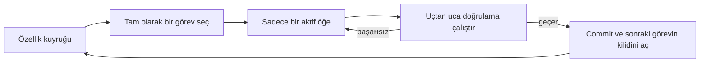
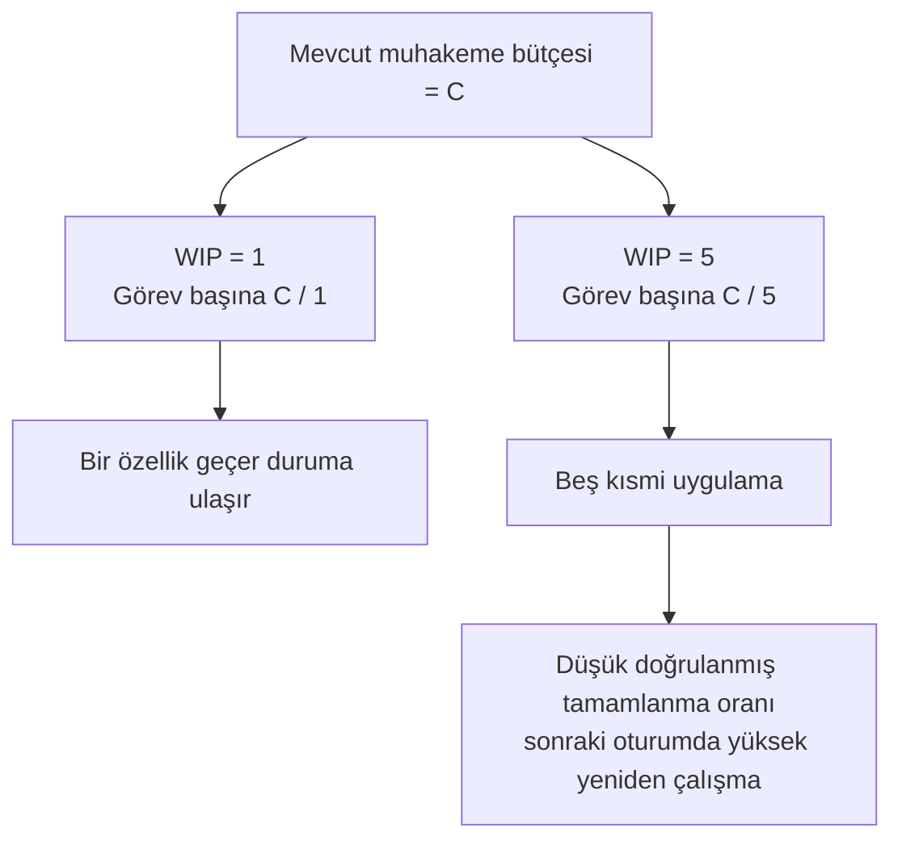

[中文版本 →](../../../zh/lectures/lecture-07-why-agents-overreach-and-under-finish/)

> Kod örnekleri: [code/](https://letslego.github.io/harness-engineering/en/lectures/lecture-07-why-agents-overreach-and-under-finish/code)
> Uygulama projesi: [Proje 04. Çalışma zamanı geri bildirimi ve kapsam kontrolü](./../../projects/project-04-incremental-indexing/)

# Ders 07. Ajanlar neden sınırı aşar ve bitirmez

Claude Code'a "bu projeye kullanıcı kimlik doğrulaması ekle" diyorsunuz ve veritabanı şemasını değiştirmeye, rotalar yazmaya, frontend bileşenlerini değiştirmeye başlıyor — bu arada hata işleme middleware'ini de yeniden yapılandırıyor. İki saat sonra kontrol ediyorsunuz: 12 dosya değiştirilmiş, 800 satır yeni kod yazılmış ve tek bir özellik uçtan uca çalışmıyor.

Çiğneyebileceğinden fazlasını ısırmak — bu söz AI ajanları için özellikle iyi geçerlidir. Ajanlar "biraz fazla yapma" dürtüsüyle doğarlar — ilgili bir şey görürler ve onunla birlikte halledilebilir, süpermarkete bir şişe soya sosu için gidip dolu bir arabayla çıkan biri gibi. Sorun şu ki, fazla satın alan insanlar sadece para harcar; aynı anda çok fazla şey yapan ajanlar hiçbirini düzgün bitirmez.

Anthropic'in "Effective harnesses for long-running agents" mühendislik blogu açıkça belirtiyor: promptlar çok geniş olduğunda ajanlar "önce bir şeyi bitir"mek yerine "aynı anda birden fazla şeye başlama" eğilimi gösterir. OpenAI'nin Codex mühendislik uygulamaları aynı şeyi buldu — açık kapsam kontrolleri olmayan görevlerde tamamlanma oranları dibe çakılıyor. Bu bir model sorunu değil — bir harness sorunudur. Sınırı çizmediniz.

## Dikkat sınırlı bir kaynaktır

Bu bir metafor değil — matematiktir. Ajanın bağlam kapasitesinin C olduğunu ve aynı anda k görev etkinleştirdiğini varsayalım. Her görev ortalama C/k muhakeme kaynağı alır. C/k tek bir görevi tamamlamak için gereken minimum eşiğin altına düştüğünde, hiçbiri bitmez. Mideniz sadece o kadar büyük — bir kerede on köfte tıkıştırırsanız hepsini sindiremezsiniz, sadece on vaka hazımsızlık yaşarsınız.

Claude Code'un gerçek davranışı söyleyicidir. Ona "kullanıcı kaydı ekle" deyin ve şunu yapabilir:

1. Bir User modeli oluşturmak
2. Kayıt rotasını yazmak
3. E-posta doğrulamasına ihtiyaç duyduğunu fark etmek, bir posta servisi eklemek
4. Şifrelerin hashlanması gerektiğini görmek, bcrypt getirmek
5. Hata işlemenin tutarsız olduğunu fark etmek, genel hata middleware'ini yeniden yapılandırmak
6. Test dosyası yapısının dağınık olduğunu görmek, dizini yeniden organize etmek

Altı adım sonra her biri yarı tamamlandı. Uçtan uca doğrulama yok, yarı pişmiş kodlar arasında karmaşık bağlaşım var ve parçaları toplamak için bir sonraki oturum tamamen kayıp olacak. Aynı anda altı yemek pişiren biri gibi — her yemek tencerede ama hiçbiri tabağa konmadı. Hepsi yanıyor.

Anthropic'in deneysel verileri bunu doğrudan destekliyor: "küçük bir sonraki adım" stratejisi kullanan ajanlar (WIP=1'e eşdeğer) geniş promptlar kullanan ajanlardan %37 daha yüksek görev tamamlanma oranı gösteriyor. Daha ilginç olanı, ajanlar tarafından üretilen kod satırı sayısı gerçek özellik tamamlamasıyla zayıf negatif korelasyona sahiptir — daha fazla kod yazıldı, daha az özellik tamamlandı. Çiğneyebileceğinden fazlasını ısırmak, veriyle kanıtlandı.

## WIP=1 iş akışı





## Temel kavramlar

- **Sınırı aşma (Overreach)**: Ajan tek bir oturumda optimal olandan daha fazla görev etkinleştirir. Ölçülebilirdir — 0'ı uçtan uca geçen 5 özellik yapmak sınırı aşmadır.
- **Yarım bırakma (Under-finish)**: Tüm etkinleştirilen görevlerden uçtan uca doğrulamayı geçen görevlerin oranı eşiğin altına düşer. Kod yazılmış ama testler geçmiyorsa bu yarım bırakmadır.
- **WIP Limiti (Work-in-Progress Limit)**: Kanban metodolojisinden. Temel fikir: aynı anda kaç görevin uçuşta olduğunu sınırlamak. Ajanlar için WIP=1 en güvenli varsayılan değerdir — sıradakine başlamadan önce birini bitirin. Açık büfe gibi — tabağı doldurmayın, bir tabağı bitirin sonra geri dönün.
- **Tamamlanma kanıtı (Completion Evidence)**: Bir görevin "devam ediyor"dan "tamamlandı"ya geçmesi için sağlaması gereken doğrulanabilir koşul. Bu olmadan ajanlar "kod iyi görünüyor"u "davranış testleri geçiyor"un yerine koyarlar.
- **Kapsam yüzeyi (Scope Surface)**: Her düğümün bir iş birimi olduğu ve kenarların bağımlılıklar olduğu DAG yapısı. Durumlar dört ile sınırlıdır: not_started, active, blocked, passing.
- **Tamamlama baskısı (Completion Pressure)**: Harness'ın WIP limitleri ve tamamlanma kanıtı gereksinimleri aracılığıyla uyguladığı kısıtlayıcı kuvvet, ajanı yeni bir göreve başlamadan önce mevcut görevi bitirmeye zorlar.

## Sınırı aşma ve yarım bırakma simbiyotiktir

Bu iki sorun bağımsız değildir — birbirlerini güçlendirirler. Sınırı aşma dikkati sulandırır, sulandırılmış dikkat yarım bırakmaya neden olur ve geride bırakılan yarı tamamlanmış kod sistem karmaşıklığını artırır, bu da sonraki görevde daha fazla sınırı aşmayı tetikler. Kısır döngü.

Kanban terimleriyle: Little Yasası bize L = lambda * W diyor. Devam eden iş L çok yüksekse (aynı anda çok fazla şey yapmak), her görev için bekleme süresi W kaçınılmaz olarak artar. Ajanlar için bu, her özelliğin başlangıçtan doğrulanmış tamamlanmaya kadar daha uzun sürdüğü ve başarısızlık olasılığının büyüdüğü anlamına gelir.

Bu insan dünyasında da eski bir sorundur — Steve McConnell *Rapid Development*'ta kapsam kaymasının proje başarısızlığının önde gelen nedeni olduğunu belgeledi. Ancak insanların en azından "yeterince yaptım" sezgisi vardır. Ajanların yoktur. Bir sonraki fikri üretmek modele neredeyse hiçbir ekstra token maliyeti yüktür — "burada bunu da düzelteyim" yazmak çok az kayda değer — ancak her ek değişiklik ajanın dikkatini sulandırır. Her ekstra tabağın neredeyse sıfır marjinal maliyeti olan ama mideniz yalnızca o kadar kapasiteye sahip olan bir açık büfe gibi.

## Doğru nasıl yapılır

### 1. WIP=1'i zorla

Bu en doğrudan ve etkili yöntemdir. Harness'ınızda ajana açıkça söyleyin: **herhangi bir zamanda yalnızca bir görev "aktif" durumunda olabilir.** Claude Code'un CLAUDE.md'sinde veya Codex'in AGENTS.md'sinde şunu yazın:

```
## İş Kuralları
- Aynı anda bir özellik üzerinde çalışın
- Mevcut özellik uçtan uca doğrulamayı geçtikten sonra bir sonraki özelliği başlatın
- A özelliğini uygularken "B özelliğini de yeniden yapılandır"mayın
```

Açık büfede yemek yemek gibi — aynı anda bir tabak, geri dönmeden önce bitirin.

### 2. Her görev için açık tamamlanma kanıtı tanımlayın

Tamamlandı, "kod yazıldı" değil — "davranış doğrulaması geçti"dir. Özellik listenizde her girişin bir doğrulama komutuna ihtiyacı vardır:

```
F01: Kullanıcı Kaydı
  Doğrulama: curl -X POST /api/register -d '{"email":"test@example.com","password":"123456"}' | jq .status == 201
  Durum: passing
```

### 3. Kapsam yüzeyini dışsallaştırın

Tüm görev durumlarını kaydetmek için makine tarafından okunabilir bir dosya (JSON veya Markdown) kullanın. Herhangi bir yeni oturum bu dosyayı okuyabilir ve hemen bilebilir: hangi görev aktif? Hangi davranış tamamlanmış sayılır? Hangi doğrulamalar geçti?

### 4. Doğrulanmış tamamlanma oranını izleyin

Harness sürekli olarak VCR (Verified Completion Rate) = doğrulanmış görevler / etkinleştirilen görevler izlemelidir. VCR < 1.0 olduğunda yeni görev etkinleştirmelerini engelleyin.

## Gerçek dünya örneği

8 özellikli bir REST API projesi, iki strateji karşılaştırıldı:

**Açık büfe modu (kısıtsız)**: Ajan oturum 1'de aynı anda 5 özelliği etkinleştirir. 12 dosyada ~800 satır üretir. Uçtan uca test geçme oranı: %20 — yalnızca kullanıcı kaydı çalışıyor. Diğer 4 özellik: veritabanı şeması oluşturuldu ama doğrulama mantığı eksik, rotalar tanımlandı ama yanlış yanıt formatları döndürüyor. Aynı anda altı yemek pişiren biri gibi, sadece biri zar zor yenilebilir. Oturum 3'ün sonunda 8 özellikten yalnızca 3'ü tamamlandı.

**Tek tabak modu (WIP=1)**: Ajan oturum 1'de yalnızca kullanıcı kaydı üzerinde çalışır. 4 dosyada ~200 satır üretir. Uçtan uca testler: %100 geçiyor. Temiz, doğrulanmış bir uygulamayı commit eder. Oturum 4'ün sonunda 8 özellikten 7'si tamamlandı (8.'si harici bir bağımlılık tarafından engellendi).

Sonuç: daha az toplam kod (800 vs 1200 satır) ama daha etkili kod. Tamamlanma oranı: %87.5 vs %37.5. Bir seferde bir ısırık alın ve aslında daha çok yiyin.

## Önemli çıkarımlar

- **WIP=1 ajan harness'ları için varsayılan güvenli ayardır** — birini bitirin, sonra sıradakine başlayın; paralelleştirmeye çalışmayın. Bir ısırıkta şişman olamazsınız.
- **Tamamlanma kanıtı yürütülebilir olmalı** — "kod iyi görünüyor" sayılmaz; "curl 201 döndürüyor" sayılır.
- **Kapsam yüzeyi dosya olarak dışsallaştırılmalıdır** — sadece konuşmada bahsedilmemeli, depoda makine tarafından okunabilir bir formatta kaydedilmelidir.
- **Sınırı aşma ve yarım bırakma simbiyotiktir** — birini çözmek diğerini de çözer.
- **"Daha az yap ama bitir" her zaman "daha çok yap ama yarım bırak"ı yener** — ajan kod satırları ve özellik tamamlanma oranı negatif korelasyondadır. Kalite her zaman miktarı yener.

## Daha fazla okuma

- [Effective harnesses for long-running agents - Anthropic](https://www.anthropic.com/engineering/effective-harnesses-for-long-running-agents) — Anthropic'in mühendislik blogu, "küçük bir sonraki adım" stratejisinin ayrıntılı tartışması
- [Harness Engineering - OpenAI](https://openai.com/index/harness-engineering/) — OpenAI'nin harness mühendisliğinin eksiksiz ele alınışı
- [Kanban: Successful Evolutionary Change - David Anderson](https://www.goodreads.com/book/show/1070822.Kanban) — WIP limitlerinin klasik kaynağı
- [Rapid Development - Steve McConnell](https://www.goodreads.com/book/show/125171.Rapid_Development) — Proje başarısızlığının önde gelen nedeni olarak kapsam kaymasına ilişkin ampirik veriler

## Alıştırmalar

1. **Görev atomizasyonu**: Geniş bir gereksinim seçin (örneğin "bir kullanıcı yönetim sistemi uygula") ve onu en az 5 atomik iş birimine bölün. Her birim için şunları belirtin: (a) tek davranış tanımı, (b) yürütülebilir doğrulama komutu, (c) bağımlılıklar. Kırılımın WIP=1 kısıtını karşılayıp karşılamadığını kontrol edin.

2. **Karşılaştırma deneyi**: Aynı projeyi iki kez çalıştırın — bir kez kısıtlamasız, bir kez WIP=1 zorunlu kılınmış. Karşılaştırın: doğrulanmış tamamlanma oranı, toplam kod satırı, etkili kod oranı.

3. **Tamamlanma kanıtı denetimi**: Yakın tarihli bir ajan çalıştırmasının çıktısını inceleyin, her kod değişikliğini "tamamlanmış davranış," "tamamlanmamış davranış" veya "iskele" olarak sınıflandırın. Her tamamlanmamış davranış için eksik doğrulama komutları ekleyin.
