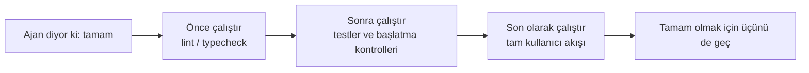
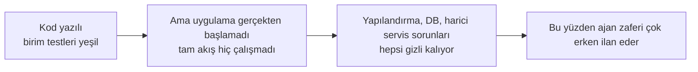

[中文版本 →](../../../zh/lectures/lecture-09-why-agents-declare-victory-too-early/)

> Bu ders için kod örnekleri: [code/](https://letslego.github.io/harness-engineering/en/lectures/lecture-09-why-agents-declare-victory-too-early/code)
> Uygulamalı pratik: [Proje 05. Ajanın kendi işini doğrulamasına izin verin](./../../projects/project-05-grounded-qa-verification/)

# Ders 9. Ajanların çok erken zaferi ilan etmesini önlemek

Bir ajandan "şifre sıfırlama" özelliğini uygulamasını istiyorsunuz. Veritabanı şemasını değiştiriyor, API uç noktasını yazıyor, e-posta şablonunu ekliyor, birim testleri çalıştırıyor (hepsi geçiyor) ve sonra güvenle "tamam" diyor. Aslında çalıştırmaya çalıştığınızda — şifre sıfırlama bağlantısı gönderilemez (eksik e-posta servis yapılandırması), veritabanı geçişi yarı yolda başarısız olur (şema tutarsızlığı) ve uçtan uca akış bir kez bile yürütülmemiştir.

Bu his size yabancı gelmemeli — tüm sınav kâğıdını doldurmak, güvenle ilk teslim etmek, ardından notlar geldiğinde başarısız olmak gibi. Kâğıdın dolu olması cevapların doğru olduğu anlamına gelmez.

Bu izole bir vaka değildir. Guo ve diğerlerinin 2017 ICML klasik makalesi şunu kanıtladı: **modern sinir ağları sistematik olarak aşırı güvenlidir** — modellerin bildirdiği güven gerçek doğruluklarından önemli ölçüde daha yüksektir. Aynı şey AI kod yazma ajanları için de geçerlidir: "hissederler" bittiler ama gerçekte çok uzaklar. Harness'ınız ajanın "hislerini" dışsallaştırılmış, yürütmeye dayalı doğrulamayla değiştirmelidir.

## Kaygan zemin

Erken tamamlanma ilanları neredeyse her zaman aynı kalıbı izler: kod iyi görünür — sözdizimi doğrudur, mantık makul görünür ve statik analiz belirgin hata göstermez. Ancak harness kapsamlı yürütme doğrulamasını zorlamaz, bu yüzden ajan gerçekten çalıştırmayı atlar veya yalnızca kısmi testleri çalıştırır. Birim testleri çalıştırır ama entegrasyon testlerini atlar; testleri çalıştırır ama kapsamı kontrol etmez. Nihayetinde "kod iyi görünüyor" "özellik tamamlandı"nın kanıtı olarak alınır. Ve sınav kâğıdı teslim edilir.

Her adımda bilgi kaybedilir. Görev spesifikasyonlarından kod uygulamasına, çalışma zamanı davranışına kadar her dönüşüm önyargı getirebilir ve atlanan her doğrulama bilgi asimetrisini şiddetlendirir.

## Üç katmanlı sonlandırma kontrolü





## Temel kavramlar

- **Erken tamamlanma ilanı**: Ajan görevin tamamlandığını iddia eder, ancak karşılanmamış doğruluk spesifikasyonları hâlâ vardır. Temel sorun: ajan kod düzeyindeki yerel güvene dayalı karar verir, sistem düzeyindeki doğruluk ise küresel doğrulama gerektirir.
- **Güven kalibrasyon önyargısı**: Ajanın kendi bildirdiği tamamlanma güveni ile gerçek tamamlanma kalitesi arasındaki sistematik fark. Karmaşık çok dosyalı görevler için bu önyargı önemli ölçüde pozitiftir — ajan her zaman gerçekte performans gösterdiğinden daha güvenlidir. Sınavdan sonra her zaman puanlarını fazla tahmin eden bir öğrenci gibi.
- **Sonlandırma kriterleri**: Harness'ta tanımlanan açık, yürütülebilir bir yargı koşulları kümesi. Ajan tamamlanmayı ilan etmeden önce tüm koşulları karşılamalıdır. "Tamam" öznel bir yargıdan nesnel bir karara dönüşür.
- **Doğrulama-onaylama çift kapısı**: İlk doğrulama katmanı "kod belirtilen davranışı doğru şekilde uyguladı mı" kontrol eder; ikinci onaylama katmanı "sistem düzeyindeki davranış uçtan uca gereksinimleri karşılıyor mu" kontrol eder. Tamamlanmış sayılmak için her ikisi de geçmelidir.
- **Runtime geri bildirim sinyalleri**: Program yürütmesinden günlükler, süreç durumları ve sağlık kontrolleri. Bu, harness'ın tamamlanma kalitesini değerlendirmesi için nesnel temeldir.
- **Tamamlanma öncelik kısıtı**: Önce işlevsel doğruluğu doğrulayın, sonra performansı ele alın ve son olarak stili ele alın. Çekirdek işlevsellik doğrulanana kadar yeniden yapılandırma yasaktır.

## Birim testleri geçmek ≠ görev tamamlandı

Bu en yaygın tuzaktır ve en tehlikelisidir. Ajan kodu yazdı, birim testlerini çalıştırdı, hepsi yeşil aldı ve "tamam" dedi. Ancak birim testlerinin tasarım felsefesi — test edilen birimi izole etmek ve bağımlılıkları mocklamak — tam olarak bileşenler arası sorunları tespit etmesini imkansız kılan şeydir:

**Arayüz uyumsuzluğu**: Render sürecinin preload betiğine ilettiği dosya yolu göreli bir yoldur, ancak preload betiği mutlak bir yol bekler. Kendi birim testleri mock kullandı ve geçti. Sorun yalnızca uçtan uca testler sırasında keşfedilir. Bir koroda her müzisyenin kendi başına mükemmel pratik yapması, birlikte çaldıklarında farklı tonlarda olduklarını fark etmesi gibi.

**Durum yayma hataları**: Bir veritabanı geçişi tablo şemasını değiştirir, ancak ORM önbellekleme katmanı eski şema için önbellek girişlerini hâlâ tutar. Birim testleri her seferinde taze bir mock ortam sağlar, bu da bu katmanlar arası durum tutarsızlığını ortaya çıkarmaz.

**Ortam bağımlılığı**: Kod test ortamında (her şeyin mocklandığı yerde) doğru davranır ancak yapılandırma farklılıkları, ağ gecikmesi veya servis kullanılamazlığı nedeniyle gerçek ortamda başarısız olur. Prova odasında mükemmel söylemek gibi ama sahnede ses ekipmanı sorunlarıyla karşılaşmak.

### "Bu arada yeniden yapılandıralım" tamamlanma yargısı için zehirdir

Claude Code'un yaygın bir davranış kalıbı vardır: çekirdek işlevsellik doğrulamayı geçmeden önce kodu yeniden yapılandırmaya, performansı optimize etmeye ve stili geliştirmeye başlar. Knuth'un "Erken optimizasyon tüm kötülüklerin köküdür" alıntısı ajan senaryosunda yeni bir anlam kazanır — yeniden yapılandırma doğrulanmış ve doğrulanmamış kod arasındaki sınırı değiştirir, daha önce örtük olarak doğru olan kod yollarını kırabilir. Matematik makalesini bitirmeden önce çoktan seçmeli cevaplarınızı daha iyi format için yeniden kopyalamak gibi — sadece zaman kaybetmekle kalmaz, yanlış da kopyalayabilirsiniz.

### Öz-değerlendirmedeki sistematik önyargı

Anthropic 2026 araştırmalarında daha derin bir başarısızlık kalıbı keşfetti: **bir ajandan kendi işini değerlendirmesi istendiğinde, bir insan gözlemcinin kaliteyi açıkça düşük göreceği durumlarda bile sistematik olarak aşırı pozitif değerlendirmeler verir.** Bu, bir öğrenciden kendi sınavını notlandırmasını istemek gibidir — kendi cevaplarına her zaman özellikle hoşgörülü davranırlar.

Bu sorun öznel görevlerde (tasarım estetiği gibi) özellikle şiddetlidir — bir "düzen zarif" yargısı bir takdir konusudur ve ajan güvenilir şekilde pozitife meyleder. Doğrulanabilir sonuçları olan görevlerde bile, ajanın performansı kötü yargı tarafından engellenebilir.

Çözüm ajanı "daha objektif" yapmak değildir — aynı modelin üretip değerlendirmesi doğal olarak kendine cömert davranmaya yatkındır. **Çözüm "çalışanı" "kontrol edenden" ayırmaktır.** Tıpkı bir öğrencinin kendi sınavını notlandırmaması gerektiği gibi — bağımsız bir notlayıcıya ihtiyacınız vardır.

Özellikle "titiz" olacak şekilde ayarlanmış bağımsız bir değerlendirici ajan, üreten ajanın kendi kendini değerlendirmesinden çok daha etkilidir. Anthropic'in deneysel verileri:

| Mimari | Runtime | Maliyet | Çekirdek özellikler çalışıyor mu? |
|--------------|---------|------|------------------------|
| Tek Ajan (çıplak koşu) | 20 dk | 9$ | Hayır (oyun varlıkları girdiye yanıt vermiyor) |
| Üç Ajan (planlayıcı + üretici + değerlendirici) | 6 saat | 200$ | Evet (oyun tamamen oynanabilir) |

Bu tam olarak aynı model (Opus 4.5) ve tam olarak aynı prompt ("2B retro oyun editörü inşa et"). Tek fark harness — "çıplak çalıştırma"dan "planlayıcı gereksinimleri genişletir → üretici özellik bazında uygular → değerlendirici Playwright kullanarak gerçek tıklama testi yapar"a.

> Kaynak: [Anthropic: Harness design for long-running application development](https://www.anthropic.com/engineering/harness-design-long-running-apps)

## Erken teslimleri nasıl önlemeli

### 1. Sonlandırma yargısını dışsallaştırın

Tamamlanma yargısı ajanın kendisi tarafından yapılmamalıdır. Harness sonlandırma doğrulamasını bağımsız olarak yürütmeli, ajanın güveni değil, runtime sinyallerini girdi olarak kullanmalıdır. Bunu `CLAUDE.md`'de açıkça yazın:

```
## Bitirme Tanımı
- Özellik tamam = uçtan uca doğrulama geçti, "kod yazıldı" değil
- Gerekli doğrulama seviyeleri:
  1. Birim testleri geçer
  2. Entegrasyon testleri geçer
  3. Uçtan uca akış doğrulaması geçer
- Seviye 1 başarısız olursa seviye 2'ye geçmeyin
- Seviye 2 başarısız olursa seviye 3'e geçmeyin
```

### 2. Üç katmanlı sonlandırma doğrulaması inşa edin

- **Katman 1: Sözdizimi ve statik analiz**. En düşük maliyet, en az bilgi, ama geçmeli. Bu minimum kontroldür — başka bir şeye bakmadan önce kelimeleri doğru yazmalısınız.
- **Katman 2: Runtime davranış doğrulaması**. Test yürütme, uygulama başlatma kontrolleri, kritik yol doğrulaması. Bu tamamlanmanın temel kanıtıdır. Sadece yazmak yeterli değildir; çalışmalıdır.
- **Katman 3: Sistem düzeyinde onay**. Uçtan uca test, entegrasyon doğrulaması, kullanıcı senaryosu simülasyonu. Erken ilanlara karşı son savunma hattı. Sadece çalışmak yeterli değildir; doğru çalışmalıdır.

### 3. Ajanlar için iyi "kırmızı kalem işaretlemeleri" tasarlayın

OpenAI, Codex pratiği sırasında özellikle etkili bir kalıp tanıttı: **ajanlar için hata mesajları düzeltme talimatlarını içermelidir**. Tembel bir notlayıcı gibi sadece büyük bir kırmızı çarpı çizmeyin; iyi bir öğretmen gibi olun ve kenara "işte bunu şu şekilde değiştirmelisin" yazın. `"Test başarısız"` kullanmayın, `"Test başarısız: POST /api/reset-password 500 döndü. Ortam değişkenlerinde e-posta servis yapılandırmasının var olduğunu kontrol edin. Şablon dosyası templates/reset-email.html konumunda olmalıdır."` kullanın. Bu spesifik, eyleme dönüştürülebilir geri bildirim, ajanın insan müdahalesi olmadan kendini düzeltmesine olanak tanır.

### 4. Runtime sinyallerini yakalayın

Etkili runtime sinyalleri şunları içerir:
- Uygulama başarılı bir şekilde başladı ve hazır duruma ulaştı mı?
- Kritik özellik yolları runtime'da başarılı bir şekilde yürütüldü mü?
- Veritabanı yazımları, dosya işlemleri ve diğer yan etkiler doğru muydu?
- Geçici kaynaklar temizlendi mi?

## Gerçek dünya örneği

**Görev**: Kullanıcı şifre sıfırlama işlevini uygulayın. Veritabanı işlemlerini, e-posta göndermeyi ve API uç nokta değişikliklerini içerir.

**Erken teslim yolu**: Ajan veritabanı şemasını değiştirir, API uç noktasını yazar, e-posta şablonunu ekler, birim testleri çalıştırır (geçer) ve tamamlandığını ilan eder. Sınav kâğıdı tamamen dolduruldu.

**Gerçek puan düşürmeleri**: (1) Uçtan uca akış test edilmedi — sıfırlama bağlantısının gerçek gönderimi ve doğrulanması hiçbir zaman onaylanmadı. (2) Veritabanı geçişi kısmi yürütmeden sonra başarısız oldu, şema tutarsızlığına neden oldu. (3) Hedef ortamda e-posta servis yapılandırması eksikti.

**Harness müdahalesi**: Sonlandırma doğrulaması zorlandı — (1) Sıfırlama uç noktası erişilebilirliğini doğrulamak için tam uygulamayı başlatın; (2) Tam sıfırlama akışını yürütün; (3) Veritabanı durumu tutarlılığını doğrulayın. Tüm kusurlar oturum içinde bulundu, sonraki düzeltmelerin maliyetinin 5-10 katından tasarruf edildi. Bağımsız notlayıcı gerçek sorunları buldu.

## Önemli çıkarımlar

- **Ajanlar sistematik olarak aşırı güvenlidir** — güven kalibrasyon önyargısı nesnel bir gerçektir. Sınav kâğıdını doldurmak doğru yaptığınız anlamına gelmez.
- **Tamamlanma yargısı dışsallaştırılmalıdır** — harness bağımsız olarak doğrular; ajanın "hislerine" güvenmeyin. Öğrenciler kendi sınavlarını notlandıramaz.
- **Üç katmanın hepsi gereklidir** — sözdizimi geçer, davranış geçer, sistem geçer, katman katman ilerler.
- **Hata mesajları iyi bir öğretmenin kırmızı kalem işaretlemesi gibi olmalıdır** — ajanın kendini düzeltebilmesi için spesifik düzeltme adımlarını içerin.
- **Çekirdek işlevsellik doğrulanana kadar yeniden yapılandırma yok** — tamamlanma öncelik kısıtı erken optimizasyonu önlemenin anahtarıdır.

## Daha fazla okuma

- [On Calibration of Modern Neural Networks - Guo et al.](https://arxiv.org/abs/1706.04599) — Modern derin ağların sistematik olarak aşırı güvenli olduğunu kanıtlar
- [Building Effective Agents - Anthropic](https://www.anthropic.com/research/building-effective-agents) — Tamamlanma yargısında runtime kanıtının kritik rolü
- [Harness Engineering - OpenAI](https://openai.com/index/harness-engineering/) — Erken tamamlanma ilanı ajanların ana başarısızlık modlarından biridir
- [The Art of Software Testing - Myers](https://www.goodreads.com/book/show/137543.The_Art_of_Software_Testing) — Test yöntem hiyerarşileri ve etkinliği hakkında klasik referans

## Alıştırmalar

1. **Sonlandırma doğrulama fonksiyonu tasarımı**: Veritabanı geçişi ve API değişikliği içeren bir görev için eksiksiz bir sonlandırma doğrulaması tasarlayın. Gerekli runtime sinyallerini ve her sinyal için geçer/başarısız kriterlerini listeleyin. Gerçek bir görevde çalıştırın ve ne tür gizli sorunlar bulduğunu kaydedin.

2. **Kalibrasyon önyargısı ölçümü**: 10 farklı tür kod yazma görevi seçin ve ajanın kendi bildirdiği tamamlanma güveni ile gerçek tamamlanma kalitesini kaydedin. Önyargı değerini hesaplayın ve görev karmaşıklığıyla ilişkisini analiz edin.

3. **Çok katmanlı savunma deneyi**: Aynı görev kümesinde üç yapılandırma çalıştırın — (a) yalnızca statik analiz, (b) birim testi ekleyin, (c) tam üç katmanlı doğrulama. Erken tamamlanma ilanlarının oranını ve yakalanmamış kusurların sayısını karşılaştırın.
