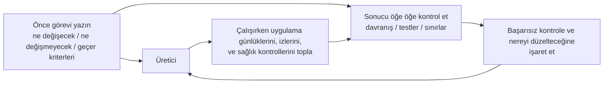

[中文版本 →](../../../zh/lectures/lecture-11-why-observability-belongs-inside-the-harness/)

> Kod örnekleri: [code/](https://amitabhakarmakar.github.io/harness-engineering/en/lectures/lecture-11-why-observability-belongs-inside-the-harness/code)
> Uygulama projesi: [Proje 06. Eksiksiz harness (Bitirme Projesi)](./../../projects/project-06-runtime-observability-and-debugging/)

# Ders 11. Gözlemlenebilirlik neden harness'ın içinde olmalı

## Bu ders hangi sorunu çözer?

Bir ajandan bir özellik uygulamasını istiyorsunuz. 20 dakika çalışıyor, bir sürü dosyayı değiştiriyor, ardından size "tamam ama iki test başarısız" diyor. Neden başarısız olduklarını soruyorsunuz — "emin değilim, zamanlama sorunu olabilir." Hangi kritik yolları değiştirdiğini soruyorsunuz — "koda bakayım..."

Bu ajanın yetenek eksikliği değil. Bu harness'ınızın yeterli gözlemlenebilirlik sağlamamasıyla ilgili. **Gözlemlenebilirlik olmadan ajanlar belirsizlik altında karar verir, değerlendirmeler öznel yargılara dönüşür ve yeniden denemeler kör dolaşmaya dönüşür.** Hem OpenAI hem de Anthropic güvenilirliği bir kanıt sorunu olarak tanımlar — harness, runtime davranışını ve değerlendirme sinyallerini bir sonraki kararı yönlendirebilecek bir formda ortaya çıkarmalıdır.

## Temel kavramlar

- **Runtime gözlemlenebilirliği**: Sistem düzeyindeki sinyaller — günlükler, izler, süreç olayları, sağlık kontrolleri. "Sistem ne yaptı"yı cevaplar.
- **Süreç gözlemlenebilirliği**: Harness karar artefaktlarına görünürlük — planlar, değerlendirme ölçütleri, kabul kriterleri. "Bu değişiklik neden kabul edilmeli"yi cevaplar.
- **Görev izi**: Görev başlangıcından tamamlanmaya kadar eksiksiz bir karar yolu kaydı, dağıtık sistemlerdeki istek izlemeye benzer. Ajanın attığı her adım, bağlamla birlikte kaydedilir.
- **Sprint sözleşmesi**: Kodlama başlamadan önce müzakere edilen kısa vadeli bir anlaşma — görev kapsamını, doğrulama standartlarını ve hariç tutmaları belirtir. Süreç gözlemlenebilirliği için temel araç.
- **Değerlendirici ölçütleri (rubrik)**: Kalite değerlendirmesini öznel yargıdan kanıta dayalı yapılandırılmış puanlamaya dönüştürür. Farklı değerlendiricilerin aynı çıktı için benzer sonuçlar üretmesini sağlar.
- **Katmanlı gözlemlenebilirlik**: Sistem katmanı ve süreç katmanı gözlemlenebilirliği aynı anda tasarlanmış ve birbirini güçlendirir. Runtime sinyalleri davranışı açıklar; süreç artefaktları niyeti açıklar.

## Katmanlı gözlemlenebilirlik



## Bu neden olur

### Gözlemlenebilirlik eksikliğinin gerçek maliyeti

Bir harness gözlemlenebilirlikten yoksun olduğunda dört tür sorun sistematik olarak ortaya çıkar:

**"Doğru" ile "doğru görünür"ü ayırt edememek**: Bir fonksiyon kod incelemesi sırasında mükemmel görünür — doğru sözdizimi, sağlam mantık. Ancak çalışma zamanında bir kenar durum işleme hatası belirli girdiler altında yanlış sonuçlar üretir. Yalnızca runtime izleri gerçek yürütme yolunun beklentilerden saptığını ortaya çıkarabilir.

**Değerlendirme mistisizme dönüşür**: Puanlama ölçütleri ve kabul kriterleri olmadan değerlendiriciler (insan veya ajan) örtük varsayımlara güvenir. Aynı çıktı farklı değerlendiricilerden çılgınca farklı değerlendirmeler alabilir. Kalite değerlendirmesi tekrarlanamaz hâle gelir.

**Yeniden denemeler kör tahminlere dönüşür**: Ajan neden başarısız olduğunu bilmediğinde yeniden deneme yönü rastgeledir. Yanlış yönde tekrar tekrar deneyebilir — gerçek başarısızlık kök nedenini göz ardı ederken ilgisiz kod yollarını düzeltebilir. Her kör yeniden deneme token ve zamana mal olur.

**Oturum devir bilgi uçurumu**: Eksiksiz olmayan iş bir sonraki oturuma teslim edildiğinde, gözlemlenebilirlik eksikliği yeni oturumun sistem durumunu sıfırdan teşhis etmek zorunda olduğu anlamına gelir. Anthropic'in uzun süre çalışan ajan gözlemleri bu gereksiz tanının toplam oturum süresinin %30-50'sini tüketebileceğini gösteriyor.

### Gerçek bir Claude Code senaryosu

"Planlayıcı-üretici-değerlendirici" üç-rollü iş akışı kullanan bir harness'ın "uygulamaya karanlık mod ekle" görevini yürüttüğünü hayal edin.

**Gözlemlenebilirlik olmadan**: Planlayıcı belirsiz bir açıklama çıkarır. Üretici karanlık modu o belirsizliğe dayalı uygular ama planlayıcının örtük beklentileriyle eşleşmez. Değerlendirici kendi örtük standartlarına göre reddeder ama neyin spesifik olarak yanlış olduğunu ifade edemez. Üretici belirsiz red nedenlerine göre kör şekilde yeniden dener. Döngü 3-4 kez tekrarlanır, yaklaşık 45 dakika sürer, zar zor kabul edilebilir bir çıktı üretir.

**Tam gözlemlenebilirlikle**: Planlayıcı bir sprint sözleşmesi çıkarır — hangi bileşenleri değiştireceğini, her biri için doğrulama standartlarını ve hariç tutmaları (yazdırma stilleri yok) listeler. Üretici sözleşmeye göre uygular. Runtime gözlemlenebilirliği her bileşenin stil yükleme ve uygulama sürecini kaydeder. Değerlendirici spesifik kanıt alıntılarıyla boyut boyut değerlendirmek için bir puanlama ölçütü kullanır. Bir iterasyon yüksek kaliteli bir sonuç üretir, yaklaşık 15 dakika.

3 kat verim farkı. Tek değişen şey gözlemlenebilirlik.

### Ajanlar bunu neden kendileri çözemez

Şöyle düşünebilirsiniz: "Ajan kendi günlüklerini yazdıramaz mı?" Sorunlar şunlardır:

1. Ajan bilmediğini bilmez — ihtiyaç duyduğunu fark etmediği sinyalleri proaktif olarak kaydetmez.
2. Günlük formatları tutarsızdır — farklı oturumlar farklı günlük formatları kullanır, sistematik analizi imkansız kılar.
3. Süreç gözlemlenebilirliği günlüklerle çözülemez — sprint sözleşmeleri ve puanlama ölçütleri harness düzeyinde destek gerektiren yapılandırılmış artefaktlardır.

## Doğru nasıl yapılır

### 1. Runtime sinyal toplamayı harness'a inşa edin

Ajanın kendi günlüklerini yazdırmasına güvenmeyin. Harness bu sinyalleri otomatik olarak toplamalıdır:

- **Uygulama yaşam döngüsü**: Başlatma, hazır, çalışıyor, kapatma aşaması durumları
- **Özellik yolu yürütmesi**: Kritik yol yürütmesinin kayıtları, giriş noktaları, kontrol noktaları ve çıkışlar dahil
- **Veri akışı**: Bileşenler arasında akan verinin kayıtları
- **Kaynak kullanımı**: Anormal kaynak kullanım kalıpları (örneğin sürekli büyüyen bellek)
- **Hatalar ve istisnalar**: Yalnızca hata mesajları değil, tam hata bağlamı

### 2. Sprint sözleşmeleri uygulayın

Her görev başlamadan önce üretici ve değerlendirici (aynı ajanın farklı çağrıları olabilir) bir sözleşme müzakere eder:

```markdown
# Sprint Sözleşmesi: Karanlık Mod Desteği

## Kapsam
- Tema değiştirme bileşenini değiştir
- Genel CSS değişkenlerini güncelle
- Karanlık mod testleri ekle

## Doğrulama Standartları
- Her bileşen için görsel regresyon testleri geçer
- Ana akış uçtan uca testleri geçer
- Stilsiz içerik flaşı (FOUC) yok

## Hariç Tutmalar
- Yazdırma stilleri ele alınmaz
- Üçüncü taraf bileşen karanlık modu ele alınmaz
```

### 3. Bir değerlendirici ölçütü kurun

"İyi mi değil mi"yi ölçülebilir puanlamaya dönüştürün:

```markdown
# Puanlama Ölçütü

| Boyut | A | B | C | D |
|-----------|---|---|---|---|
| Kod doğruluğu | Tüm testler geçer | Ana akış geçer | Kısmi geçer | Yapı başarısız |
| Mimari uyum | Tamamen uyumlu | Küçük sapmalar | Belirgin sapmalar | Ciddi ihlaller |
| Test kapsamı | Ana + kenar durumlar | Yalnızca ana akış | Yalnızca iskelet | Test yok |
```

### 4. OpenTelemetry ile standartlaştırın

Her harness oturumu için bir iz, her görev için bir span ve her doğrulama adımı için alt span'lar oluşturun. Kilit bilgileri etiketlemek için standart öznitelikler kullanın. Bu şekilde gözlemlenebilirlik verisi standart araç zincirleriyle (Jaeger, Zipkin) entegre olur.

## Gerçek dünya örneği

"Karanlık mod desteği ekle" yürüten planlayıcı-üretici-değerlendirici iş akışı kullanan bir harness:

**Gözlemlenemeyen sürüm**: 3-4 tur kör yeniden deneme, 45 dakika, zar zor kabul edilebilir çıktı. Değerlendirici "doğru hissettirmiyor" der ama spesifik olarak ne olduğunu söyleyemez. Üretici yanlış yönlerde önemli zaman boşa harcar.

**Tam gözlemlenebilir sürüm**:
- Sprint sözleşmesi kapsamı, standartları ve hariç tutmaları netleştirir
- Runtime izleri her bileşenin stil yükleme sürecini kaydeder
- Puanlama ölçütü boyut boyut yapılandırılmış değerlendirme sağlar
- Bir iterasyon yüksek kaliteli sonuçlar üretir, 15 dakika

3 kat verim iyileştirmesi, daha kararlı kalite, tekrarlanabilir değerlendirmeler.

## Önemli çıkarımlar

- **Gözlemlenebilirlik bir harness mimari özelliğidir** — sonradan eklenen bir özellik değil, tasarım sırasında düşünülmesi gereken temel bir yetenektir.
- **Her iki gözlemlenebilirlik katmanı da gereklidir** — runtime sinyalleri "ne oldu"yu, süreç artefaktları "neden bu şekilde yapıldı"yı açıklar.
- **Sprint sözleşmeleri hizalamayı öne çeker** — "üreticinin değerlendiricinin öngörülebilir nedenlerle hemen reddedeceği bir şey inşa etmesi"ni önler.
- **Puanlama ölçütleri değerlendirmeyi tekrarlanabilir yapar** — farklı değerlendiriciler aynı çıktı için benzer puanlar üretir.
- **Gözlemlenebilirlik eksikliği oturum süresinin %30-50'sini gereksiz tanılara harcar.**

## Daha fazla okuma

- [Observability Engineering - Charity Majors](https://www.honeycomb.io/blog/observability-engineering-book) — Modern gözlemlenebilirlik mühendisliği için teori ve pratik çerçevesi
- [Dapper - Google (Sigelman et al.)](https://research.google/pubs/pub36356/) — Büyük ölçekli dağıtık izlemede çığır açan uygulama
- [Harness Design - Anthropic](https://www.anthropic.com/engineering/harness-design-long-running-apps) — Sprint sözleşmelerini ve değerlendirici ölçütlerini tanıtmak
- [Site Reliability Engineering - Google](https://sre.google/sre-book/table-of-contents/) — Üretim sistemlerinde gözlemlenebilirliğin sistematik uygulanması

## Alıştırmalar

1. **Gözlemlenebilirlik farkı analizi**: Mevcut harness'ınızı sistem katmanı ve süreç katmanı gözlemlenebilirliği için denetleyin. Mevcut sinyallerden ayırt edilemeyen sistem durumlarını bulun ve eklemeler önerin.

2. **Sprint sözleşmesi pratiği**: Gerçek bir görev için bir sprint sözleşmesi yazın. Ajanın sözleşmeye göre yürütmesine izin verin ve sözleşmeyle ve olmadan verimliliği ve kaliteyi karşılaştırın.

3. **Görev izi inşası**: Tam bir kod yazma görevi sırasında ajanın her işlem adımını kaydedin. OpenTelemetry anlamsal kurallarıyla etiketleyin. İzdeki bilgi darboğazlarını analiz edin — hangi adımlar kararlar için yeterli sinyal desteğinden yoksun.
