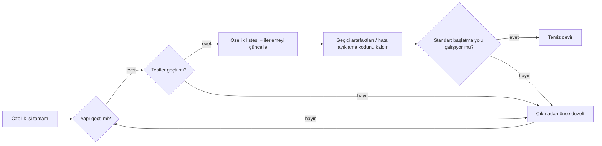
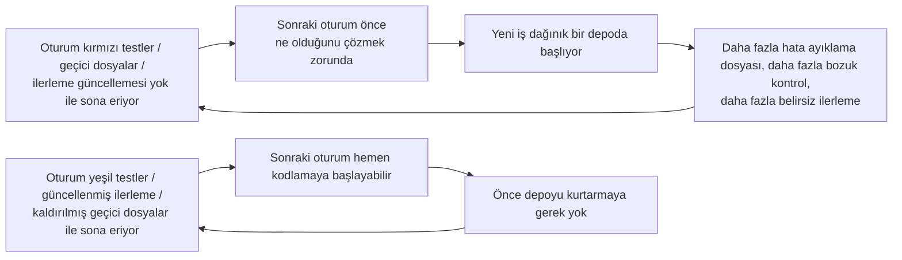

[中文版本 →](../../../zh/lectures/lecture-12-why-every-session-must-leave-a-clean-state/)

> Kod örnekleri: [code/](https://amitabhakarmakar.github.io/harness-engineering/en/lectures/lecture-12-why-every-session-must-leave-a-clean-state/code)
> Uygulama projesi: [Proje 06. Eksiksiz harness (Bitirme Projesi)](./../../projects/project-06-runtime-observability-and-debugging/)

# Ders 12. Her oturum neden temiz bir durumla bitmeli

## Bu ders hangi sorunu çözer?

Ajanınız tüm öğleden sonra çalışıyor, 20 dosyayı değiştiriyor, kodu commit ediyor, oturum sona eriyor. Sonraki ajan oturumu başlıyor ve hemen şunları keşfediyor: yapı bozuk, testler kırmızı, geçici hata ayıklama dosyaları her yerde, özellik listesi güncellenmemiş ve ilerleme tamamen belirsiz. Yeni oturum ilk 30 dakikasını sadece "geçen oturum aslında ne yaptı" çözmek için harcıyor.

Hem OpenAI hem de Anthropic açıkça belirtiyor: **uzun vadeli güvenilirlik yalnızca tek koşum başarısına değil, operasyonel disipline bağlıdır.** Oturum çıkışındaki durumun kalitesi bir sonraki oturumun verimliliğini doğrudan belirler. Bunu Git en iyi uygulamaları gibi düşünün — her commit, yarı tamamlanmış kod yığını değil, atomik, derlenebilir bir değişiklik olmalıdır.

## Temel kavramlar

- **Temiz durum**: Sistem oturum sonunda beş koşulu karşılar — yapı geçer, testler geçer, ilerleme kaydedilir, bayatlamış artefakt yoktur, başlatma yolu mevcuttur. Herhangi birinin eksik olması oturumun "tamam" olmadığı anlamına gelir.
- **Oturum bütünlüğü**: Veritabanı işlemlerine benzer — ya tamamen commit edin ve temiz bir durum bırakın ya da son tutarlı duruma geri alın. Orta yol yok.
- **Kalite belgesi**: Her modül için kalite derecelerini sürekli kaydeden aktif bir artefakt. Bir kerelik değerlendirme değil, kod tabanının zamanla daha güçlü mü yoksa daha zayıf mı hâle geldiğini gösteren bir takipçi.
- **Temizleme döngüsü**: Kod tabanındaki entropiyi sistematik olarak azaltmayı amaçlayan düzenli bir bakım oturumu. Acil bir düzeltme değil, rutin operasyonlar.
- **Harness sadeleştirmesi**: Model yetenekleri geliştikçe artık gerekli olmayan harness bileşenlerini periyodik olarak kaldırın. Bugün vazgeçilmez olan bir kısıt üç ay sonra gereksiz bir yük olabilir.
- **İdempotent temizleme**: Temizleme işlemleri kaç kez çalıştırıldığına bakılmaksızın aynı sonucu üretir. Başarısızlık-yeniden deneme senaryolarında bile temizlemenin güvenli kalmasını sağlar.

## Temiz durumun beş boyutu





## Bu neden olur

### Entropi büyümesi varsayılan durumdur

Lehman'ın yazılım evrim yasaları bize şunu söylüyor: sürekli değişime uğrayan sistemler, aktif olarak yönetilmedikçe kaçınılmaz olarak karmaşıklıkta artar. Bu özellikle AI kod yazma ajanları için doğrudur — her oturum değişiklikler getirir ve çıkışta temizlik olmadan teknik borç katlanarak birikir.

Gerçek veriler söyleyicidir. Temizleme stratejisi olmadan ajanlarla 12 hafta geliştirilen bir proje:

- Hafta 1: Yapı geçme oranı %100, test geçme oranı %100, yeni oturum başlatma 5 dk
- Hafta 4: Yapı %95, testler %92, başlatma 15 dk
- Hafta 8: Yapı %82, testler %78, başlatma 35 dk
- Hafta 12: Yapı %68, testler %61, başlatma 60+ dk

Aynı proje bir temizleme stratejisiyle:

- Hafta 1: %100, %100, 5 dk
- Hafta 12: %97, %95, 9 dk

12 hafta sonra: yapı geçme oranı 29 puan, yeni oturum başlatma süresi %85 farklı. Bu teorik değil — gözlemlenen bir farktır.

### Temiz durumun beş boyutu

Temiz durum yalnızca "kod derler" değildir. Birlikte değerlendirilen beş boyuttur:

**Yapı boyutu**: Kod hatasız derlenir mi? Bu en temeldir — sonraki oturumun önce yapı hatalarını düzeltmek zorunda kalmaması gerekir.

**Test boyutu**: Tüm testler geçer mi? Oturum öncesi var olan testler dahil — oturum mevcut işlevselliği bozmamaktan sorumludur. Ve "benim makinemde çalışıyor" yerine CI'de doğrulanmalıdır.

**İlerleme boyutu**: Mevcut ilerleme makine tarafından okunabilir bir artefakta kaydedilmiş mi? Tamamlanan alt görevler geçme kriterleriyle, devam eden ancak tamamlanmayan alt görevler mevcut durumla, henüz başlamamış alt görevler. İyi ilerleme kayıtları oturum başlatma tanı süresini %60-80 azaltır.

**Artefakt boyutu**: Bayatlamış veya belirsiz geçici artefaktlar var mı? Hata ayıklama günlükleri, geçici dosyalar, yorum satırı yapılmış kod, TODO işaretleri — bunların hepsi bir sonraki oturum için bilişsel yükü artırır.

**Başlatma boyutu**: Standart başlatma yolu mevcut mu? Sonraki oturum manuel müdahale olmadan çalışmaya başlayabilir mi? Ortam başlatma, kod tabanı yükleme, bağlam edinme, görev seçimi — bu yollar bozulmamalıdır.

### "Sonra temizleriz" hiç temizlemeyeceğiz demektir

En yaygın zihinsel tuzak "bu oturumda temizlemeye vakit yok, sonraki sefer yaparım"dır. Ancak bir sonraki ajan oturumu ne bıraktığınızı bilmez — bir dağınık kod ve belirsiz bir durum görür. "Bu kodun hangi kısımları kasıtlı, hangileri geçici" çıkarımı yapmak için önemli zaman harcayacaktır.

Daha kötüsü, her oturumun kendi görev hedefleri vardır. Yeni oturum yeni iş yapmak için oradadır, önceki oturumun karmaşasını temizlemek için değil. Karmaşayı görmezden gelir ve üzerinde yeni iş başlatır, karmaşanın üzerine daha fazla karmaşa getirir. Bu entropinin pozitif geri bildirim döngüsüdür.

## Doğru nasıl yapılır

### 1. Temiz durum tamamlanma gereksinimi olarak

Harness'ta açıkça tanımlayın: **oturum tamamlanması = görev doğrulamayı geçer VE temiz durum kontrolü geçer.** Herhangi birinin eksikliği oturumun tamamlanmadığı anlamına gelir. CLAUDE.md'ye yazın:

```
## Oturum Çıkış Kontrol Listesi
- [ ] Yapı geçer (npm run build)
- [ ] Tüm testler geçer (npm test)
- [ ] Özellik listesi güncellendi
- [ ] Kalan hata ayıklama kodu yok (console.log, debugger, TODO)
- [ ] Standart başlatma yolu mevcut (npm run dev)
```

### 2. Çift modlu temizleme stratejisi

İki temizleme modunu birleştirin:

**Anında temizleme (her oturum sonunda)**: Oturum sırasında oluşturulan geçici artefaktları temizleyin, özellik listesi durumunu güncelleyin, yapı ve testlerin geçtiğinden emin olun. Bu "referans sayma" temizliğidir.

**Periyodik temizleme (haftalık)**: Tam sistem taraması — birikmiş yapısal sorunları ele alın, kalite belgelerini güncelleyin, sürüklenmeyi tespit etmek için karşılaştırma testleri çalıştırın. Bu "iz sürme" temizliğidir.

### 3. Bir kalite belgesi tutun

Bir kalite belgesi her modülü sürekli puanlayan aktif bir artefakttır:

```markdown
# Kalite Belgesi

## Kullanıcı Kimlik Doğrulama Modülü (Kalite: A)
- Doğrulama geçer: Evet
- Ajan anlayabilir: Evet
- Test kararlılığı: Kararlı
- Mimari sınırlar: Uyumlu
- Kod kuralları: Takip edildi

## Ödeme Modülü (Kalite: C)
- Doğrulama geçer: Kısmen (ödeme geri çağrısı test edilmedi)
- Ajan anlayabilir: Zor (mantık 3 dosyaya dağılmış)
- Test kararlılığı: Kararsız (2 dengesiz test)
- Mimari sınırlar: İhlaller mevcut
- Kod kuralları: Kısmen takip edildi
```

Yeni oturumlar bu belgeyi okur ve hemen nereye öncelik vereceğini bilir. En düşük puanlı modülü önce düzeltin.

### 4. Harness'ı periyodik olarak sadeleştirin

Anthropic'ten önemli bir içgörü: **her harness bileşeni vardır çünkü model bir şeyi kendi başına güvenilir şekilde yapamaz. Ancak modeller geliştikçe bu varsayımlar bayatlar.** Üç ay önce vazgeçilmez olan bir kısıt bugün gereksiz bir yük olabilir.

Önerilen uygulama: Her ay bir harness bileşenini seçin, geçici olarak devre dışı bırakın ve karşılaştırma görevlerini çalıştırın. Sonuçlar bozulmazsa, kalıcı olarak kaldırın. Bozulursa, geri yükleyin veya daha hafif bir alternatifle değiştirin.

### 5. Temizleme işlemleri idempotent olmalıdır

Temizleme betikleri tekrar tekrar çalıştırılması güvenli olmalıdır:

```bash
# İdempotent temizleme işlemleri
rm -f /tmp/debug-*.log  # -f dosyalar olmadığında hata olmamasını sağlar
git checkout -- .env.local  # Bilinen duruma geri yükle
npm run test  # Temizliğin bir şey bozmadığını doğrula
```

## Gerçek dünya örneği

12 hafta boyunca ajanlarla geliştirilen bir Electron uygulaması, iki yaklaşımın karşılaştırması:

**Temizleme stratejisi olmadan** (kontrol grubu): Hafta 12, yapı geçme oranı %68, test geçme oranı %61, yeni oturum başlatma 60+ dk, bayatlamış artefaktlar 103.

**Temizleme stratejisiyle** (deneysel grup): Her oturum sonunda tam temiz durum kontrolü + haftalık temizleme döngüsü. Hafta 12, yapı geçme oranı %97, test geçme oranı %95, yeni oturum başlatma 9 dk, bayatlamış artefaktlar 11.

12 haftaya kadar, deneysel grubun yapı geçme oranı 29 puan, test geçme oranı 34 puan daha yüksek ve yeni oturum başlatma süresi %85 daha düşüktür.

## Önemli çıkarımlar

- **Temiz durum oturum tamamlanması için gerekli bir koşuldur** — isteğe bağlı ev temizliği değil, "bitirme tanımının" bir parçası.
- **Beş boyutun hepsi gereklidir** — yapı, testler, ilerleme, artefaktlar, başlatma — her biri açıkça kontrol edilmelidir.
- **Kalite belgeleri kod tabanı sağlığını izlenebilir kılar** — yalnızca bozulduğunu bildiğinizi düzeltebilirsiniz.
- **Harness'ı periyodik olarak sadeleştirin** — model yetenekleri geliştikçe artık gerekli olmayan kısıtlamaları kaldırın.
- **"Sonra temizleriz" hiç temizlememeye eşittir** — entropi büyümesi varsayılandır; yalnızca aktif temizleme buna karşı koyar.

## Daha fazla okuma

- [Clean Code - Robert C. Martin](https://www.goodreads.com/book/show/3735293-clean-code) — Kod temizliğinin sistematik ilkeleri
- [Harness Engineering - OpenAI](https://openai.com/index/harness-engineering/) — Temel bir harness tasarım gereksinimi olarak tekrarlanabilirlik
- [Effective Harnesses - Anthropic](https://www.anthropic.com/engineering/effective-harnesses-for-long-running-agents) — Uzun vadeli güvenilirlik için temiz oturum çıkışlarının kritik rolü
- [Programs, Life Cycles, and Laws of Software Evolution - Lehman](https://ieeexplore.ieee.org/document/1702314) — Aktif bakım olmadan sistem karmaşıklığının kaçınılmaz olarak büyüdüğünü kanıtlayan yazılım evrim yasaları

## Alıştırmalar

1. **Temiz durum kontrol listesi**: Kod tabanınız için beş boyutu kapsayan bir oturum çıkış kontrol listesi tasarlayın. 5 ardışık oturumda uygulayın ve boyut başına ihlalleri kaydedin.

2. **Karşılaştırma**: İki harness varyantıyla sabit bir görev kümesi kullanın (temiz durum gereksinimleriyle/olmadan). Tamamlanma oranını, yeniden deneme sayısını ve kusur kaçış oranını karşılaştırın.

3. **Harness sadeleştirme pratiği**: Bir harness bileşenini seçin, geçici olarak devre dışı bırakın ve karşılaştırma görevlerini çalıştırın. Sonuçları onunla ve onsuz karşılaştırın. Tutmaya, kaldırmaya veya değiştirmeye karar verin.
