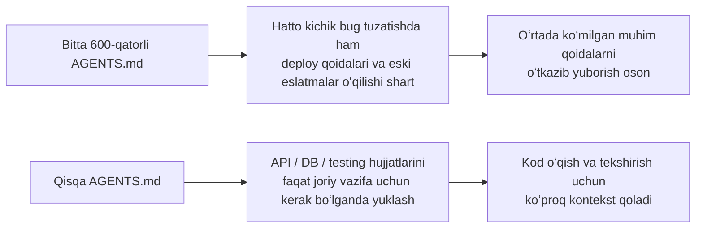
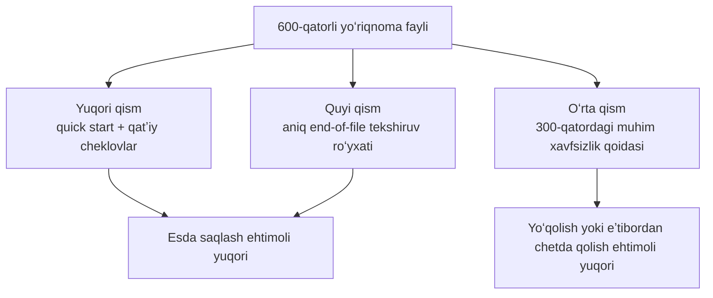

[English version →](../../../en/lectures/lecture-04-why-one-giant-instruction-file-fails/)

> Kod misollari: [code/](https://letslego.github.io/harness-engineering/en/lectures/lecture-04-why-one-giant-instruction-file-fails/code)
> Amaliy loyiha: [Loyiha 02. Agent oʻqiy oladigan ish maydoni](./../../projects/project-02-agent-readable-workspace/)

# 4-maʼruza. Yoʻriqnomalarni fayllar boʻylab ajrating

Siz harness muhandisligiga jiddiy yondashdingiz — tabriklaymiz. Siz `AGENTS.md` faylini yaratdingiz va oʻzingiz oʻylay olgan barcha qoidalar, cheklovlar va olingan saboqlarni uning ichiga joyladingiz. Bir oydan soʻng fayl 300 qatorga, ikki oydan soʻng 450 qatorga, uch oydan soʻng esa 600 qatorga yetdi. Keyin siz agentʼning samaradorligi aslida yomonlashayotganini seza boshlaysiz — oddiy bugʼni tuzatish uchun agent juda koʻp kontekstni hech qanday aloqasi boʻlmagan deploy yoʻriqnomalarini oʻqishga sarflaydi; 300-qatorda koʻmilgan muhim xavfsizlik cheklovi mutlaqo eʼtiborsiz qoldiriladi; kod yozish uslubi boʻyicha bir-biriga zid uchta qoida mavjudligi sababli, agent har safar oʻzboshimchalik bilan ulardan birini tanlaydi.

Bu “ulkan yoʻriqnoma fayli” tuzogʻidir. Bu xuddi chamadonni haddan tashqari toʻldirishga oʻxshaydi — hamma narsa foydali koʻrinadi, shuning uchun zanjirsimon yopqich yorilib ketgudek boʻlguncha tiqib tashlaysiz. Ichki kiyimingizni almashtirish uchun butun sumkani boʻshatishingiz kerak boʻladi. Siz toʻla chamadonni koʻtarib yurasiz, lekin aslida uning ichidagilarning faqat uchdan bir qismini ishlatasiz, xolos.

## Muammoning ildizidagi yopiq doira

Eng keng tarqalgan yopiq doira shunday davom etadi: agent xato qiladi, siz “buning oldini olish uchun qoida qoʻsh” deysiz, uni `AGENTS.md` fayliga qoʻshasiz, u vaqtinchalik ishlaydi, soʻngra agent boshqa bir xatoga yoʻl qoʻyadi, yana boshqa qoida qoʻshasiz, shu zaylda takrorlanib, fayl hajmi nazoratdan chiqib ketadi.

Bu sizning aybingiz emas. Bu juda tabiiy reaksiya — har safar biror narsa xato ketganda “qoida qoʻshish” xuddi har safar uydan chiqayotganingizda “har ehtimolga qarshi” sumkaga yana bitta narsa tashlab olishdek mantiqli tuyuladi. Lekin uning toʻplanib boruvchi taʼsiri halokatlidir. Keling, aniq nimalar xato ketishini koʻrib chiqaylik.

**Kontekst byudjeti yeb tugatiladi.** Agentʼning kontekst oynasi cheklangan. Aytaylik, agentʼingiz 200K tokenlik oynaga (Claudeʼning standarti) ega. Shishib ketgan yoʻriqnoma fayli 10-20K tokenni yeb qoʻyishi mumkin. Hali joy koʻpdek koʻrinyaptimi? Biroq murakkab vazifa oʻnlab manba fayllarini oʻqishni talab qilishi mumkin, vositalarning ishlash natijalari ham kontekstni oladi va suhbat tarixi toʻplanib boradi. Agent kodni tushunishi kerak boʻlgan vaqtga kelib, byudjet allaqachon tugab qolgan boʻladi — bu “har ehtimolga qarshi” narsalar bilan toʻldirilgan chamadonda noutbukingiz uchun joy qolmaganiga oʻxshaydi.

**Oʻrtada yoʻqotish (Lost in the middle).** “Lost in the Middle” tadqiqoti (Liu va boshqalar, 2023) shuni aniq isbotladiki, LLMʼlar uzun matnlarning oʻrtasidagi maʼlumotlardan boshidagi yoki oxiridagi maʼlumotlarga qaraganda sezilarli darajada kamroq samaradorlik bilan foydalanadi. Sizning `AGENTS.md` faylingiz 600 qator, 300-qatorda esa “barcha maʼlumotlar bazasi soʻrovlari parametrlangan soʻrovlardan foydalanishi shart” deb yozilgan — bu qatʼiy xavfsizlik cheklovi. Lekin u oʻrtada koʻmilib yotibdi va agent katta ehtimol bilan unga eʼtibor bermaydi. Xuddi toʻlib toshgan chamadoningiz tagidagi quyoshdan himoya qiluvchi krem (sunscreen) kabi — uning oʻsha yerda ekanligini bilasiz, uch marta qidirasiz, topa olmaysiz va oxirida boshqasini sotib olasiz.

**Ustuvorlik mojarolari.** Fayl muhokama qilinmaydigan qatʼiy cheklovlarni (“hech qachon eval() ni ishlatmang”), muhim dizayn yoʻriqnomalarini (“funksional uslubni afzal koʻring”) va maxsus tarixiy saboqni (“oʻtgan haftada WebSocket xotira sizib chiqishini (memory leak) toʻgʻriladik, shunga oʻxshash andozalarga eʼtibor bering”) aralashtirib yuboradi. Ushbu uchta qoidaning ahamiyati umuman har xil, ammo ular faylda bir xil koʻrinadi. Agentʼda farqlash uchun hech qanday ishonchli signal yoʻq — xuddi chamadonga aralashtirib tashlangan pasportingiz va quvvatlash kabelingiz singari, qaysi biri muhimroq ekanini farqlash imkonsiz.

**Xizmat koʻrsatishdagi eskirish (Maintenance decay).** Katta fayllarga texnik xizmat koʻrsatish tabiatan qiyin. Eskirgan yoʻriqnomalar deyarli oʻchirib tashlanmaydi — chunki ularni oʻchirish oqibatlari noaniq (“balki boshqa narsa bu qoidaga bogʻliqdir?”), yangi yoʻriqnomalar qoʻshish esa bepuldek tuyuladi. Natija: fayl faqat oʻsadi, hech qachon qisqarmaydi va signal-shovqin nisbati doimiy ravishda pasayib boradi. Bu xuddi dasturiy taʼminotda texnik qarz toʻplanishiga oʻxshaydi.

**Qarama-qarshiliklar yigʻilishi.** Turli vaqtlarda qoʻshilgan yoʻriqnomalar bir-biriga zid kela boshlaydi — biri “TypeScript strict rejimini ishlating” deydi, boshqasi “baʼzi eski fayllarda (legacy files) any tipiga ruxsat beriladi” deydi. Agent har safar ulardan birini tavakkaliga tanlaydi. Xuddi onangiz “issiqroq kiyin” deb, otangiz “juda qalin kiyinma” deyishi va siz eshik oldida kimga quloq solishni bilmay turishingizdek gap.

## Asosiy tushunchalar

- **Yoʻriqnoma shishuvi (Instruction Bloat)**: Yoʻriqnoma fayli kontekst oynasining 10-15% dan ortigʻini egallaganda, u kod oʻqish va vazifani muhokama qilish uchun ajratilgan byudjetni yeb yuborishni boshlaydi. 600 qatorli `AGENTS.md` fayli 10,000-20,000 token ishlatishi mumkin — bu agent hatto ish boshlamasidan oldin 128K oynaning 8-15% qismini yeb qoʻyganini bildiradi.
- **Oʻrtada yoʻqotish effekti (Lost in the Middle Effect)**: Liu va boshqalarning 2023-yildagi tadqiqoti LLMʼlar uzun matnlarning oʻrtasidagi maʼlumotlardan boshidagi yoki oxiridagi maʼlumotlarga qaraganda sezilarli darajada kamroq samaradorlik bilan foydalanishini isbotladi. 600 qatorli faylning 300-qatorida koʻmilgan muhim cheklov deyarli eʼtiborsiz qoldirilish ehtimoli juda yuqori.
- **Yoʻriqnomaning signal-shovqin nisbati (Instruction Signal-to-Noise Ratio (SNR))**: Fayldagi yoʻriqnomalarning joriy vazifaga aloqador boʻlgan qismi. Kichik bugʼni tuzatish jarayonida 50 qatorlik deploy yoʻriqnomalarini oʻqishga majbur boʻlish — bu past SNR demakdir.
- **Marshrutlash fayli (Routing File)**: Asosiy vazifasi hamma narsani oʻz ichiga olish emas, balki agentʼni batafsil hujjatlarga yoʻnaltirish boʻlgan qisqa kirish fayli. 50-200 qator boʻlishi yetarli.
- **Bosqichma-bosqich oshkor qilish (Progressive Disclosure)**: Avval umumiy maʼlumotni, keyin kerak boʻlganda batafsil maʼlumotni bering. Yaxshi harness dizayni xuddi yaxshi UI dizayniga oʻxshaydi — barcha variantlarni birdaniga foydalanuvchiga toʻkib tashlamang.
- **Ustuvorlik noaniqligi (Priority Ambiguity)**: Barcha yoʻriqnomalar bir xil formatda va bir joyda turganda, agent muhokama qilinmaydigan qatʼiy cheklovlarni tavsiyaviy yoʻriqnomalardan ajrata olmaydi.

## Yoʻriqnoma arxitekturasi





## Qanday qilib ajratiladi

Asosiy tamoyil: tez-tez kerak boʻladigan maʼlumotlarni yonida saqlang, vaqti-vaqti bilan kerak boʻladigan maʼlumotlarni chetroqqa qoʻying va umuman ishlatilmaydigan narsalardan voz keching.

`AGENTS.md` kirish fayli 50-200 qatordan iborat boʻlib qoladi va unda faqat eng koʻp ishlatiladigan narsalar saqlanadi — loyiha boʻyicha qisqacha maʼlumot (bir yoki ikki jumla), birinchi marta ishga tushirish buyruqlari (`make setup && make test`), global qatʼiy cheklovlar (15 tadan ortiq boʻlmagan qatʼiy qoidalar) va mavzuviy hujjatlarga havolalar (bir qatorli izoh + qoʻllanilish sharti).

```markdown
# AGENTS.md

## Loyiha haqida
Python 3.11 FastAPI backend, PostgreSQL 15 maʼlumotlar bazasi.

## Tez boshlash (Quick Start)
- Oʻrnatish: `make setup`
- Test: `make test`
- Toʻliq tekshiruv: `make check`

## Qatʼiy cheklovlar
- Barcha APIʼlar OAuth 2.0 autentifikatsiyasidan foydalanishi shart
- Barcha maʼlumotlar bazasi soʻrovlari SQLAlchemy 2.0 sintaksisidan foydalanishi shart
- Barcha PRʼlar pytest + mypy --strict + ruff check dan oʻtishi shart

## Mavzuli hujjatlar
- API dizayn andozalari (`docs/api-patterns.md`) — Endpointʼlar qoʻshganda oʻqish majburiy
- Maʼlumotlar bazasi qoidalari (`docs/database-rules.md`) — Maʼlumotlar bazasi amallarini oʻzgartirganda kerak boʻladi
- Testlash standartlari (`docs/testing-standards.md`) — Test yozish uchun qoʻllanma
```

Har bir mavzu hujjati `docs/` katalogida yoki tegishli modulning yonida mavzu boʻyicha tashkillashtirilgan holda 50-150 qatordan iborat boʻladi. Agent ularni faqat kerak boʻlganda oʻqiydi. Xuddi chamadondagi taqsimlagichlar (packing cubes) kabi — ichki kiyimlar bir boʻlimda, yuvinish vositalari ikkinchisida, quvvatlagichlar uchinchisida. Biror narsani qidirib topish uchun butun sumkani boʻshatish shart emas.

Baʼzi maʼlumotlarni toʻgʻridan-toʻgʻri kod ichiga joylashtirgan maʼqulroq — type definitionʼlar, interfeys izohlari, konfiguratsiya fayllaridagi tushuntirishlar. Agent kod oʻqiyotganda ularni tabiiy ravishda koʻradi, yoʻriqnomalarda uni takrorlashga hojat yoʻq.

Har bir yoʻriqnomaning manbasi (“bu qoida nima uchun qoʻshilgan?”), qoʻllanilish sharti (“bu qoida qachon kerak boʻladi?”) va eskirish sharti (“qanday vaziyatlarda bu qoidani olib tashlash mumkin?”) boʻlishi kerak. Muntazam ravishda audit oʻtkazing, eskirgan, keraksiz yoki qarama-qarshi bandlarni oʻchirib tashlang. Yoʻriqnomalarni xuddi koddagi kutubxonalar (dependencies) kabi boshqaring — ishlatilmaydigan kutubxonalar oʻchirib tashlanishi kerak, aks holda ular faqat tizimni sekinlashtiradi.

Agar yoʻriqnoma kirish faylida boʻlishi shart boʻlsa, uni boshiga yoki oxiriga joylashtiring — hech qachon oʻrtasiga emas. “Oʻrtada yoʻqotish” (lost in the middle) effekti bizga LLMʼlar markazdagi maʼlumotlardan koʻra boshidagi va oxiridagi maʼlumotlardan samaraliroq foydalanishini koʻrsatadi. Lekin yaxshiroq yondashuv — yoʻriqnomalarni kerak boʻlganda yuklanishi uchun mavzu hujjatlariga koʻchirishdir.

OpenAI va Anthropic ham ajratish yondashuvini bilvosita qoʻllab-quvvatlaydi. OpenAI kirish fayllari “qisqa va yoʻnaltiruvchi” boʻlishi kerak deydi, Anthropic koʻp vaqt oladigan agentʼlarni boshqarish maʼlumotlari “loʻnda va yuqori ustuvorlikka ega” boʻlishi kerak deydi. Ikkalasi ham bir xil narsani aytmoqda: hamma narsani bitta faylga tiqib tashlamang. Chamadonga shunchaki kuch bilan tiqmasdan, uni tartibga solish kerak.

## Hayotiy misol

SaaS jamoasining `AGENTS.md` fayli 50 qatordan 600 qatorgacha shishib ketdi. Fayl tarkibiga tech stack versiyalari, kod yozish standartlari, tarixiy bugʼlarni tuzatish boʻyicha eslatmalar, API qoʻllanmalari, deploy jarayonlari va jamoa aʼzolarining shaxsiy xohish-istaklari aralashib ketgan — xuddi tikish choklaridan yorilayotgan chamadonga oʻxshardi.

Agentʼning samaradorligi sezilarli darajada pasaya boshladi: oddiy bugʼlarni tuzatish jarayonida agent juda koʻp kontekstni aloqasi yoʻq deploy yoʻriqnomalarini oʻqishga sarfladi; “barcha maʼlumotlar bazasi soʻrovlari parametrlangan soʻrovlardan foydalanishi shart” degan xavfsizlik cheklovi 300-qatorda koʻmilib yotgani uchun tez-tez eʼtiborsiz qoldirildi; kod uslubidagi bir-biriga zid uchta qoida agentʼning tasodifiy xatti-harakatlanishiga sabab boʻldi.

Jamoa “chamadonni qayta tartibga solish” ishini bajardi:
1. `AGENTS.md` 80 qatorga qisqartirildi: faqat loyiha tavsifi, ishga tushirish buyruqlari va 15 ta global qatʼiy cheklovlar qoldirildi.
2. Mavzu hujjatlari yaratildi: `docs/api-patterns.md` (120 qator), `docs/database-rules.md` (60 qator), `docs/testing-standards.md` (80 qator).
3. Marshrutlash faylida mavzu hujjatlari havolalari qoʻshildi.
4. Tarixiy eslatmalar test holatlariga oʻgirildi yoki oʻchirib tashlandi.

Refaktoringdan soʻng: xuddi oʻsha vazifalar toʻplamini muvaffaqiyatli bajarish koʻrsatkichi 45% dan 72% gacha koʻtarildi. Xavfsizlik cheklovlariga rioya qilish 60% dan 95% gacha oshdi — chunki u faylning oʻrtasidan marshrutlash faylining eng tepasiga koʻchirildi, endi u “oʻrtada yoʻqolib” qolmaydi.

## Asosiy xulosalar

- “Qoida qoʻshish” — qisqa muddatli yengillik, ammo uzoq muddatli zahar. Qoida qoʻshishdan oldin oʻzingizga savol bering: buni mavzuviy hujjatda saqlagan maʼqul emasmi? Chamadonga shunchaki narsa tiqishni toʻxtating.
- Kirish fayli ensiklopediya emas, balki marshrutlash faylidir (router). Faqat umumiy maʼlumot, qatʼiy cheklovlar va havolalar oʻrin olgan 50-200 qator.
- “Oʻrtada yoʻqotish” effektidan foydalaning: muhim maʼlumotlar eng yuqoriga yoki eng pastga qoʻyiladi; ahamiyati pastroq maʼlumotlar mavzu hujjatlariga oʻtkaziladi.
- Yoʻriqnoma shishuvini (instruction bloat) texnik qarz kabi boshqaring. Muntazam tekshirib boring, har bir yoʻriqnomaning manbasi, qoʻllanilish sharti va eskirish sharti boʻlishi shart.
- Ajratishdan soʻng, SNR yaxshilanadi va agent aloqador boʻlmagan yoʻriqnomalarni qayta ishlash oʻrniga kontekst byudjetini haqiqiy vazifalarga koʻproq sarflaydi.

## Qoʻshimcha oʻqish uchun

- [OpenAI: Harness Engineering](https://openai.com/index/harness-engineering/)
- [Anthropic: Effective Harnesses for Long-Running Agents](https://www.anthropic.com/engineering/effective-harnesses-for-long-running-agents)
- [Lost in the Middle: How Language Models Use Long Contexts](https://arxiv.org/abs/2307.03172)
- [HumanLayer: Harness Engineering for Coding Agents](https://humanlayer.dev/articles/harness-engineering-for-coding-agents/)
- [Nielsen Norman Group: Progressive Disclosure](https://www.nngroup.com/articles/progressive-disclosure/)

## Mashqlar

1. **SNR auditi**: Oʻzingizning joriy kirish yoʻriqnoma faylingizni oling va barcha yoʻriqnoma yozuvlarini roʻyxatga kiriting. 5 xil keng tarqalgan vazifa turlarini tanlang va har bir yoʻriqnomaning oʻsha vazifaga aloqador yoki yoʻqligini belgilang. Har bir vazifa turi uchun SNR ni hisoblang. Aksariyat vazifalar uchun shovqin (noise) hisoblangan yoʻriqnomalar mavzu hujjatlariga koʻchirilishi kerak.

2. **Bosqichma-bosqich oshkor qilish refaktoringi**: Agar sizda 300 qatordan ortiq yoʻriqnoma fayli boʻlsa, uni quyidagilarga ajrating: (a) 100 qatordan kam boʻlgan marshrutlash fayli, (b) 3-5 ta mavzu hujjatlari. Xuddi oʻsha vazifalar toʻplamini (kamida 5 ta) oldin va keyin ishga tushiring, muvaffaqiyat koʻrsatkichlarini taqqoslang.

3. **Oʻrtada yoʻqotishni tekshirish**: Uzun yoʻriqnoma faylining mos ravishda yuqori, oʻrta va quyi qismlariga muhim cheklovni joylashtiring va har safar bitta vazifalar toʻplamini ishlating (har bir pozitsiya uchun kamida 5 ta urinish). Bajarish darajasida farq bor-yoʻqligini kuzating. Joylashuv effektining qanchalik kuchliligini koʻrib hayratda qolishingiz mumkin.
